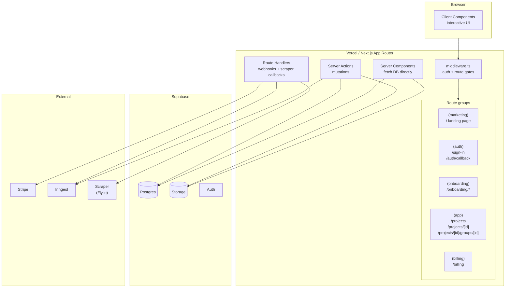

# Application — Architecture

How the Next.js app (`apps/web`, deployed at `app.speclyy.com`) is structured and how its core patterns work. For the *why* behind framework and hosting choices, see [ADR-0001](adr/0001-application-framework.md) and [ADR-0002](adr/0002-hosting-platform.md).

The app consumes three workspace packages:

- `@speclyy/db` — Drizzle schema + Postgres client.
- `@speclyy/auth` — Supabase browser/server clients + composable middleware gates.
- `@speclyy/design-system` — UI tokens, components, Tailwind preset.

---

## Overview



---

## Route groups

Next.js App Router uses folder-based routing. Route groups (`(name)`) organise routes without affecting the URL.

```
app/
├── (marketing)/
│   └── page.tsx                   → /
├── (auth)/
│   ├── sign-in/page.tsx           → /sign-in
│   └── auth/callback/route.ts     → /auth/callback
├── (onboarding)/
│   └── onboarding/
│       ├── name/page.tsx          → /onboarding/name
│       ├── studio/page.tsx        → /onboarding/studio
│       └── market/page.tsx        → /onboarding/market
├── (app)/
│   ├── layout.tsx                 → shared app shell (nav, sidebar)
│   ├── projects/
│   │   ├── page.tsx               → /projects (dashboard)
│   │   └── [projectId]/
│   │       ├── page.tsx           → /projects/[id] (project overview)
│   │       └── groups/
│   │           └── [groupId]/
│   │               └── page.tsx   → /projects/[id]/groups/[id]
│   └── account/
│       └── page.tsx               → /account
└── (billing)/
    └── billing/
        └── page.tsx               → /billing
```

Each group has its own `layout.tsx` — the app shell (nav, sidebar) only wraps `(app)` routes, not marketing or auth pages.

---

## Server Components vs Client Components

**Default: Server Component.** Every file in Next.js App Router is a Server Component unless it has `"use client"` at the top.

### When to use Server Components (no directive needed)

- Pages that fetch and display data (project list, group view, item detail)
- Layouts that need auth state or user profile
- Any component that only reads data and has no browser interactivity

```tsx
// app/(app)/projects/page.tsx — Server Component
import { createServerClient } from '@supabase/ssr'
import { cookies } from 'next/headers'

export default async function ProjectsPage() {
  const supabase = createServerClient(...)
  const { data: projects } = await supabase.from('projects').select('*')

  return <ProjectList projects={projects} />  // no loading state, no useEffect
}
```

### When to use Client Components (`"use client"`)

- Anything with event handlers (`onClick`, `onChange`, `onSubmit`)
- Anything using React hooks (`useState`, `useEffect`, `useRef`)
- Anything using browser APIs (`localStorage`, `window`, `navigator`)
- Real-time UI (item status badge that updates without a page reload)

```tsx
"use client"
// components/AddItemButton.tsx — needs onClick
export function AddItemButton({ groupId }: { groupId: string }) {
  const [open, setOpen] = useState(false)
  return <button onClick={() => setOpen(true)}>Add Item</button>
}
```

### The boundary rule

Pass data *down* from Server Components to Client Components as props. Never pass non-serialisable values (functions, class instances) through the boundary.

```tsx
// Server Component fetches, Client Component renders interactively
// ✅ correct
export default async function GroupPage({ params }) {
  const items = await db.select().from(projectItems).where(...)
  return <ItemList items={items} />  // ItemList is "use client"
}

// ❌ incorrect — fetching in a Client Component defeats RSC
"use client"
export function GroupPage({ params }) {
  const [items, setItems] = useState([])
  useEffect(() => { fetch('/api/items').then(...) }, [])
}
```

---

## Server Actions

Server Actions are async functions that run on the server, called directly from Client Components or forms. They replace REST API routes for mutations.

```tsx
// app/(app)/projects/actions.ts
"use server"
import { revalidatePath } from 'next/cache'

export async function createProject(formData: FormData) {
  const supabase = createServerClient(...)
  const { data: { user } } = await supabase.auth.getUser()
  if (!user) throw new Error('Unauthorised')

  await db.insert(projects).values({
    ownerId: user.id,
    name: formData.get('name') as string,
  })

  revalidatePath('/projects')  // tells Next.js to re-fetch this route's data
}

// Client Component calls it like a regular function
"use client"
export function NewProjectForm() {
  return (
    <form action={createProject}>
      <input name="name" />
      <button type="submit">Create</button>
    </form>
  )
}
```

**Mutations always go through Server Actions.** No client-side `fetch('/api/...')` for app mutations.

---

## Data fetching pattern

| Layer | Tool | When |
|---|---|---|
| Server Component (user data) | Supabase JS client (`createServerClient`) | Reading user's own projects, groups, items — RLS enforced via JWT |
| Server Component (internal) | Drizzle | Admin reads, background queries, joins that need service-role access |
| Server Action (mutation) | Supabase JS client | Creating/updating/deleting user data — RLS enforced |
| Route Handler (webhook) | Drizzle | Stripe webhook, Inngest callback — service-role, bypasses RLS |

```tsx
// RSC — uses Supabase client (RLS enforced automatically)
const { data: items } = await supabase
  .from('project_items')
  .select('*, project_groups(name)')
  .eq('project_id', projectId)

// Stripe webhook Route Handler — uses Drizzle (service-role, bypasses RLS)
await db
  .update(subscriptions)
  .set({ status: 'active', currentPeriodEnd: periodEnd })
  .where(eq(subscriptions.stripeSubscriptionId, subscriptionId))
```

---

## Route Handlers

Used for external callbacks only — not for app mutations (those are Server Actions).

```
app/
├── api/
│   ├── webhooks/
│   │   ├── stripe/route.ts        → POST /api/webhooks/stripe
│   │   └── inngest/route.ts       → POST /api/webhooks/inngest
│   └── scraper/
│       └── callback/route.ts      → POST /api/scraper/callback
```

These are the only `route.ts` files in the app. Everything else is a Server Action.

---

## Middleware

See [auth.md](auth.md) for the full gate chain implementation. High-level: `middleware.ts` runs on every non-static request, refreshes the Supabase session, and enforces three sequential gates: auth → onboarding → trial/subscription.

```
middleware.ts
├── runs on: all routes except /_next/static, images, fonts
├── gate 1: unauthenticated → /sign-in
├── gate 2: no onboarding → /onboarding/name
└── gate 3: trial expired or lapsed → /billing
```

---

## Environment variables

```bash
# Supabase
NEXT_PUBLIC_SUPABASE_URL=https://<project>.supabase.co
NEXT_PUBLIC_SUPABASE_PUBLISHABLE_KEY=<anon key>            # safe to expose
SUPABASE_SECRET_KEY=<service role key>         # server only, never client

# Database (Drizzle — direct connection string)
DATABASE_URL=postgresql://postgres:<password>@<host>:5432/postgres
DATABASE_URL_POOLED=postgresql://postgres:<password>@<pooler>:6543/postgres

# Stripe
STRIPE_SECRET_KEY=sk_live_...                        # server only
STRIPE_WEBHOOK_SECRET=whsec_...                      # server only
NEXT_PUBLIC_STRIPE_PUBLISHABLE_KEY=pk_live_...       # safe to expose

# Inngest
INNGEST_EVENT_KEY=<key>
INNGEST_SIGNING_KEY=<key>

# Claude (scraper service — not in Next.js)
ANTHROPIC_API_KEY=<key>

# App
NEXT_PUBLIC_APP_URL=https://app.speclyy.com
```

`NEXT_PUBLIC_` prefix exposes the variable to the browser bundle. Everything else is server-only. `SUPABASE_SECRET_KEY` and `STRIPE_SECRET_KEY` must never appear in client-side code.

---

## Rendering model summary

| Route | Rendering | Why |
|---|---|---|
| `/` (marketing) | SSG (static) | SEO, no user data |
| `/sign-in` | SSG | No user data |
| `/projects` | SSR (RSC) | User's project list, personalised |
| `/projects/[id]` | SSR (RSC) | Project data, streamed |
| `/projects/[id]/groups/[id]` | SSR (RSC) + Client hydration | Data SSR, interactive item actions client-side |
| `/billing` | SSR (RSC) | Subscription state |

---

## References

- [ADR-0001 — Application framework: Next.js](adr/0001-application-framework.md)
- [ADR-0002 — Hosting platform: Vercel](adr/0002-hosting-platform.md)
- [auth.md](auth.md) — middleware + session details
- [Next.js App Router docs](https://nextjs.org/docs/app)
