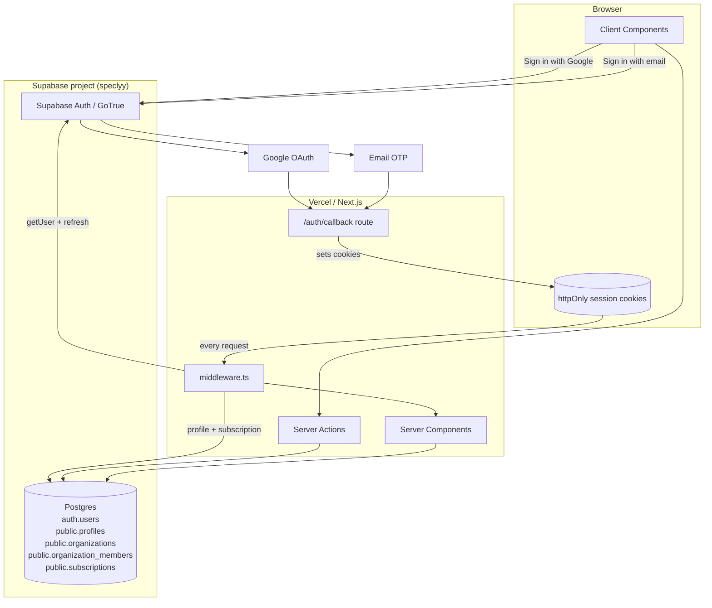

# Auth — Architecture

How authentication works in Speclyy, end-to-end. For the *why* behind these choices, see [ADR-0005](adr/0005-auth-provider.md), [ADR-0006](adr/0006-session-strategy.md), [ADR-0007](adr/0007-auth-data-model.md), [ADR-0019](adr/0019-multi-app-architecture.md), and [ADR-0021](adr/0021-single-supabase-project.md).

---

## Project boundary

A single Supabase project (`speclyy`) holds **all** Speclyy data — auth + account-level + future app-specific tables — per [ADR-0021](adr/0021-single-supabase-project.md). The earlier two-project split (shared-auth + per-app DB from ADR-0019) was reversed before any per-app tables shipped; only the project boundary changed, not the table set.

The project owns:

- `auth.users` (Supabase-managed)
- `public.profiles` — app-agnostic identity, 1:1 with `auth.users`
- `public.organizations` — account-level entity with a `type` discriminator (`individual`, `studio`, `firm`, `team`, …)
- `public.organization_members` — membership join, supports future teammate invites
- `public.subscriptions` — per-user subscriptions with a jsonb `entitlements` column keyed by app
- All future app-specific tables (projects, documents, app state) — they get real foreign keys to `auth.users.id` and `public.organizations.id` rather than opaque UUIDs.

**Cookie domain.** Supabase session cookies are set on `.speclyy.com` so any future subdomain app receives the session automatically. The leading dot is mandatory — without it the cookie is scoped to the exact host. Cookie attributes are controlled by `@supabase/ssr` in our app code (`cookieOptions: { domain: '.speclyy.com' }` env-gated to production, in [`packages/auth/src/server.ts`](../../packages/auth/src/server.ts) and [`middleware.ts`](../../packages/auth/src/middleware.ts)) — there is no longer a "cookie domain" field in the Supabase dashboard.

**UI copy vs schema.** Speclyy's UI uses the word "Studio"; the schema calls it an `organization`. The onboarding studio step writes `type = 'studio'`; Skip writes `type = 'individual'`. Users can convert individual → studio later from Settings.

---

## Overview



## Components

| Component | Role |
|---|---|
| **Supabase Auth (GoTrue)** | Runs Google OAuth + email OTP, issues JWT access + refresh tokens, manages `auth.users`. |
| **`@supabase/ssr`** | Next.js client library. Three factories: `createBrowserClient`, `createServerClient` (RSC / Server Actions), and a middleware variant that rewrites cookies. |
| **`middleware.ts`** | Runs on every non-static request. Refreshes session and enforces route gates. |
| **`public.profiles`** | App-agnostic user record, 1:1 with `auth.users`. Created via DB trigger on signup. |
| **`public.organizations`** | Account-level entity (studio/firm/team/individual) with a `type` discriminator. |
| **`public.organization_members`** | Profile ↔ organization join with `role`. Always ≥1 row per profile; supports future invites. |
| **`public.subscriptions`** | Stripe state per user. `entitlements` jsonb keys which apps/plans are unlocked. Written by the Stripe webhook handler using the service-role key. |

---

## Sign-in flow

`/sign-in` offers two options: **Continue with Google** and **Continue with email**.

### Google OAuth

1. User clicks **Continue with Google**.
2. Client Component calls:
   ```ts
   supabase.auth.signInWithOAuth({
     provider: 'google',
     options: { redirectTo: `${origin}/auth/callback` },
   })
   ```
3. Browser redirects to Google consent screen.
4. Google redirects back to `/auth/callback?code=...`.
5. `/auth/callback/route.ts` calls `supabase.auth.exchangeCodeForSession(code)`. Supabase sets cookies on the response:
   - `sb-<project-ref>-auth-token` — contains access + refresh tokens. Flags: `httpOnly`, `Secure`, `SameSite=Lax`.
6. Postgres `AFTER INSERT` trigger on `auth.users` creates the blank `public.profiles` row (first-time sign-in only).
7. Callback redirects:
   - New user (no `onboarding_completed_at`) → `/onboarding/name`
   - Existing onboarded user → `/projects`

### Email OTP (magic code)

1. User enters email and clicks **Continue with email**.
2. Client Component calls:
   ```ts
   supabase.auth.signInWithOtp({
     email,
     options: { emailRedirectTo: `${origin}/auth/callback` },
   })
   ```
3. Supabase sends a 6-digit code + magic link to the email. The same template works for sign-up and sign-in — no separate flows.
4. User enters the code on `/sign-in/verify` (or clicks the link, which hits `/auth/callback` directly).
5. Client calls `supabase.auth.verifyOtp({ email, token, type: 'email' })`. Session cookies are set identically to the OAuth path.
6. Same trigger + redirect behavior as Google (steps 6–7 above).

**Rate limits.** Supabase enforces 1 OTP per 60s per email and 30 per hour per IP by default. Surface a friendly "check your email or wait 60s" message on retry.

## Session lifecycle

- **Access token** — JWT, ~1 hour lifetime. Signed by Supabase. Middleware verifies signature locally (no round-trip).
- **Refresh token** — **90-day sliding window**, single-use. Each use issues a fresh refresh token; inactivity past 90 days forces re-authentication. Configured in the Supabase dashboard (Auth → Sessions → *Inactivity timeout* = 90d).
- **Silent refresh** — `supabase.auth.getUser()` in middleware triggers refresh if needed. New cookies returned as `Set-Cookie` headers on the response. User never sees a logout as long as they open the app at least once every 90 days.
- **Sign-out** — `supabase.auth.signOut()` revokes the refresh token server-side and clears both cookies.

---

## Middleware gate chain

See [ADR-0007](adr/0007-auth-data-model.md) for rationale.

```ts
// middleware.ts
import { NextRequest, NextResponse } from 'next/server'
import { createServerClient } from '@supabase/ssr'

const PUBLIC_PATHS = ['/', '/sign-in', '/auth/callback', '/privacy', '/terms']

export async function middleware(request: NextRequest) {
  let response = NextResponse.next({ request })

  const supabase = createServerClient(
    process.env.NEXT_PUBLIC_SUPABASE_URL!,
    process.env.NEXT_PUBLIC_SUPABASE_PUBLISHABLE_KEY!,
    {
      cookies: {
        getAll: () => request.cookies.getAll(),
        setAll: (cookiesToSet) => {
          cookiesToSet.forEach(({ name, value, options }) => {
            request.cookies.set(name, value)
            response.cookies.set(name, value, options)
          })
        },
      },
    }
  )

  // 1. Refresh session (may rewrite cookies on response)
  const { data: { user } } = await supabase.auth.getUser()

  const path = request.nextUrl.pathname
  const isPublic = PUBLIC_PATHS.some(p => path === p || path.startsWith(p + '/'))

  // 2. Unauthenticated gate
  if (!user) {
    if (isPublic) return response
    return NextResponse.redirect(new URL('/sign-in', request.url))
  }

  // 3. Onboarding gate
  const { data: profile } = await supabase
    .from('profiles')
    .select('is_onboarded')
    .eq('id', user.id)
    .single()

  const isOnboardingPath = path.startsWith('/onboarding')
  const isSignOut = path === '/sign-out'

  if (!profile?.is_onboarded && !isOnboardingPath && !isSignOut) {
    return NextResponse.redirect(new URL('/onboarding/name', request.url))
  }
  if (profile?.is_onboarded && isOnboardingPath) {
    return NextResponse.redirect(new URL('/projects', request.url))
  }

  // No app-wide subscription gate — free plan has indefinite access.
  // PDF export and shareable link export are gated inside their server actions.
  // See billing.md § Free vs Pro gating.

  return response
}

export const config = {
  matcher: ['/((?!_next/static|_next/image|favicon.ico|.*\\.(?:svg|png|jpg|jpeg)).*)'],
}
```

---

## Data model

See [ADR-0019](adr/0019-multi-app-architecture.md) and [ADR-0021](adr/0021-single-supabase-project.md) for rationale. All tables below live in the single `speclyy` Supabase project; future app-specific tables join them in the same project.

> **Greenfield.** The Supabase project has no pre-existing schema; the DDL below is the **initial** schema, not an incremental migration against live data. Drizzle still records it as its first migration file, but there is no production data to consider.

```sql
-- auth.users is Supabase-managed. Never modify.

CREATE TABLE public.profiles (
  id uuid PRIMARY KEY REFERENCES auth.users(id) ON DELETE CASCADE,
  first_name text,
  last_name text,
  market text,  -- free text "City, Region, Country" from the global picker (ADR-0020)
  onboarding_completed_at timestamptz,
  is_onboarded boolean GENERATED ALWAYS AS (onboarding_completed_at IS NOT NULL) STORED,
  has_visited_dashboard boolean NOT NULL DEFAULT false,
  -- Flipped true by the /projects page on first render. Drives the "show Free Welcome once"
  -- rule for /welcome (Speclyy only; not an account-level signal consumed by sibling apps).
  created_at timestamptz NOT NULL DEFAULT now(),
  updated_at timestamptz NOT NULL DEFAULT now()
);
CREATE INDEX profiles_is_onboarded_idx ON public.profiles (is_onboarded);

CREATE TABLE public.organizations (
  id         uuid PRIMARY KEY DEFAULT gen_random_uuid(),
  name       text NOT NULL,
  type       text NOT NULL CHECK (type IN ('individual','studio','firm','team')),
  size       text CHECK (size IN ('solo','2_5','6_10','11_plus')),
  created_at timestamptz NOT NULL DEFAULT now(),
  updated_at timestamptz NOT NULL DEFAULT now()
);
-- No UNIQUE on name — two orgs may legitimately share a name.
-- For Speclyy v1 only 'individual' and 'studio' are produced.
CREATE INDEX organizations_type_idx ON public.organizations (type);

CREATE TABLE public.organization_members (
  organization_id uuid NOT NULL REFERENCES public.organizations(id) ON DELETE CASCADE,
  user_id         uuid NOT NULL REFERENCES public.profiles(id) ON DELETE CASCADE,
  role            text NOT NULL CHECK (role IN ('owner','admin','member')) DEFAULT 'owner',
  created_at      timestamptz NOT NULL DEFAULT now(),
  PRIMARY KEY (organization_id, user_id)
);
CREATE INDEX organization_members_user_id_idx ON public.organization_members (user_id);

-- Invariant: every completed-onboarding profile has exactly one organization_members
-- row. The studio step creates an organization with type='studio'; Skip creates one
-- with type='individual' and name "{first_name} {last_name}". Either way the profile
-- is linked via organization_members with role='owner'.

CREATE TABLE public.subscriptions (
  id uuid PRIMARY KEY DEFAULT gen_random_uuid(),
  user_id uuid NOT NULL UNIQUE REFERENCES public.profiles(id) ON DELETE CASCADE,
  -- UNIQUE encodes the one-subscription-per-user MVP invariant (ADR-0017)
  -- and is the conflict target for the Stripe webhook handler's ON CONFLICT upsert.
  status text NOT NULL CHECK (status IN (
    'active','past_due','canceled','incomplete','incomplete_expired'
  )),
  -- no trial_ends_at — free plan is indefinite, no trial period
  current_period_end timestamptz,
  stripe_customer_id text UNIQUE,
  stripe_subscription_id text UNIQUE,
  promo_code_id uuid,
  entitlements jsonb NOT NULL DEFAULT '{}'::jsonb,
  -- Shape: { "speclyy": { "plan": "pro" }, "<future-app>": { "plan": "starter" } }
  -- Single-app and bundle subscriptions look identical to apps querying entitlements.
  created_at timestamptz NOT NULL DEFAULT now(),
  updated_at timestamptz NOT NULL DEFAULT now()
);
-- Note: free users have no row in this table. Only paid subscribers have a row.
CREATE INDEX subscriptions_user_id_idx ON public.subscriptions (user_id);

-- Trigger: create blank profile on auth.users insert.
-- Organization creation is handled by the onboarding Server Actions, not here,
-- because the org's type depends on whether the user completes or skips the studio step.
CREATE FUNCTION public.handle_new_user() RETURNS trigger
LANGUAGE plpgsql SECURITY DEFINER SET search_path = public AS $$
BEGIN
  INSERT INTO public.profiles (id) VALUES (new.id);
  RETURN new;
END;
$$;

CREATE TRIGGER on_auth_user_created
  AFTER INSERT ON auth.users
  FOR EACH ROW EXECUTE FUNCTION public.handle_new_user();
```

---

## Row-Level Security

All application tables enable RLS. Baseline policies on the auth-adjacent tables:

```sql
ALTER TABLE public.profiles ENABLE ROW LEVEL SECURITY;

CREATE POLICY "profiles: self read" ON public.profiles
  FOR SELECT USING (id = auth.uid());

CREATE POLICY "profiles: self update" ON public.profiles
  FOR UPDATE USING (id = auth.uid()) WITH CHECK (id = auth.uid());

ALTER TABLE public.organizations ENABLE ROW LEVEL SECURITY;

CREATE POLICY "organizations: member read" ON public.organizations
  FOR SELECT USING (
    id IN (SELECT organization_id FROM public.organization_members WHERE user_id = auth.uid())
  );

CREATE POLICY "organizations: admin update" ON public.organizations
  FOR UPDATE USING (
    id IN (
      SELECT organization_id FROM public.organization_members
      WHERE user_id = auth.uid() AND role IN ('owner','admin')
    )
  );

-- Any authenticated user may create an organization (their first one, during onboarding).
-- Pairs with the organization_members self-INSERT policy: an org is only reachable if the
-- creator also links themselves via organization_members in the same Server Action.
CREATE POLICY "organizations: authenticated insert" ON public.organizations
  FOR INSERT WITH CHECK (auth.uid() IS NOT NULL);

ALTER TABLE public.organization_members ENABLE ROW LEVEL SECURITY;

CREATE POLICY "organization_members: self read" ON public.organization_members
  FOR SELECT USING (
    user_id = auth.uid()
    OR organization_id IN (
      SELECT organization_id FROM public.organization_members WHERE user_id = auth.uid()
    )
  );

-- Users may insert their own membership rows (onboarding Server Action links profile → org).
-- No user-facing UPDATE/DELETE policy; invites/removals will use a dedicated RPC later.
CREATE POLICY "organization_members: self insert" ON public.organization_members
  FOR INSERT WITH CHECK (user_id = auth.uid());

ALTER TABLE public.subscriptions ENABLE ROW LEVEL SECURITY;

CREATE POLICY "subscriptions: self read" ON public.subscriptions
  FOR SELECT USING (user_id = auth.uid());

-- No user-facing INSERT/UPDATE policies on subscriptions.
-- Stripe webhooks write via service_role key, which bypasses RLS.
```

`auth.uid()` resolves to the user ID encoded in the JWT carried by the request's cookie. The service-role key (used only in Stripe webhooks and background jobs) bypasses RLS entirely and must never appear in client-reachable code.

Downstream tables (`projects`, `groups`, `items`, etc.) follow the same pattern, typically filtering by `owner_id = auth.uid()` or via a join through a user-owned parent.

---

## Sign-out flow

1. User clicks **Sign out**.
2. Server Action calls `supabase.auth.signOut()`.
3. Supabase revokes the refresh token server-side.
4. Session cookies cleared on the response.
5. Redirect to `/sign-in`.

---

## Edge cases

| Case | Behavior |
|---|---|
| **OAuth callback error** (`error` param) | `/auth/callback` redirects to `/sign-in?error=<code>` with a friendly message. |
| **Expired / invalid OTP code** | `verifyOtp` returns an error; `/sign-in/verify` shows "code expired, request a new one" and re-enables the resend button. |
| **OTP rate limit hit** | Client shows "too many attempts, try again in a minute"; resend button disabled for 60s. |
| **Expired refresh token** (user idle for weeks) | `getUser()` returns null; middleware treats as unauthenticated → `/sign-in`. |
| **User deleted in Supabase dashboard** | Existing cookies fail verification; middleware clears them and redirects. |
| **Profile row missing** (should not occur due to trigger) | Onboarding route defensively upserts the row before proceeding. |
| **Concurrent onboarding tabs** | Last write wins on `onboarding_completed_at`. No real risk. |
| **Cookies blocked by browser** | Sign-in fails with a user-facing error prompting the user to enable cookies for the domain. |

---

## Testing approach

- **Unit** — Middleware logic tested with mocked Supabase responses across the state matrix (auth × onboarded × subscription-status).
- **Integration (Playwright)** — Full sign-in flow with a test Google account, complete onboarding, verify cookie flags, verify RLS by running queries as user X and asserting no user-Y rows are returned.
- **Schema contract** — Assert the `handle_new_user` trigger creates a `profiles` row on `auth.users` insert.
- **Webhook contract** — Simulate Stripe subscription lifecycle events and verify `subscriptions` rows update correctly; assert user is never redirected incorrectly after a `trialing` → `active` transition.

---

## References

- [ADR-0005 — Auth provider: Supabase Auth](adr/0005-auth-provider.md)
- [ADR-0006 — Session strategy: cookie SSR via `@supabase/ssr`](adr/0006-session-strategy.md)
- [ADR-0007 — Auth data model and middleware gates](adr/0007-auth-data-model.md) (data-model section superseded)
- [ADR-0016 — Onboarding data model revision: studios entity + free-text market](adr/0016-onboarding-data-model-revision.md) (table naming superseded by 0019; market picker UX superseded by 0020; structural + free-text decisions preserved)
- [ADR-0019 — Multi-app architecture: shared auth project + organizations entity](adr/0019-multi-app-architecture.md) (per-app DB boundary superseded by ADR-0021; rest current)
- [ADR-0020 — Onboarding market: global city search](adr/0020-onboarding-market-global-cities.md)
- [ADR-0021 — Single Supabase project for auth and app data](adr/0021-single-supabase-project.md)
- [Supabase Auth with Next.js App Router](https://supabase.com/docs/guides/auth/server-side/nextjs)
- [`screen-inventory.md`](../screen-inventory.md) §1–2 (auth + onboarding)
- [`user-flows.md`](../user-flows.md) "Supporting Flow — First-time setup"
