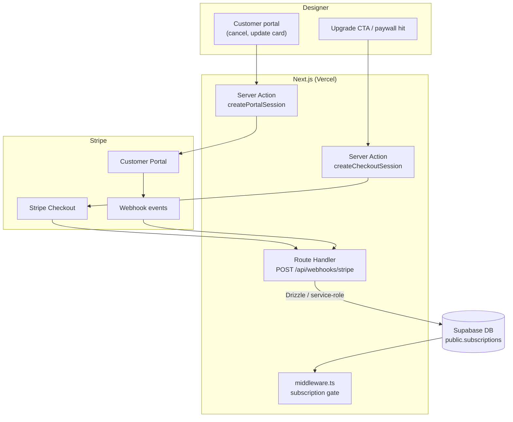

# Billing

End-to-end architecture for Stripe billing: subscription model, checkout, webhooks, trial/lapse states, and failure handling. This is the authoritative doc for the billing subsystem — other docs reference here for anything beyond column-level detail.

---

## Overview



---

## Subscription model

### Plans

| Plan | Stripe Price ID | Price | Trial | Features |
|---|---|---|---|---|
| Pro Monthly | `price_xxx_monthly` | $37/month | 7 days (no card required) | Full access |
| Pro Annual | `price_xxx_annual` | $29/month (billed annually, $348/yr — 30% off) | 7 days (no card required) | Full access |

> Price IDs are stored in env vars (`STRIPE_PRICE_ID_PRO_MONTHLY`, `STRIPE_PRICE_ID_PRO_ANNUAL`), not hardcoded. The plan selection is passed from the client to `createCheckoutSession` and resolved to the correct env var server-side.

### Subscription states

Stripe is the source of truth. The `subscriptions` table mirrors Stripe state; webhooks keep it in sync.

| Stripe status | `subscriptions.status` | App access |
|---|---|---|
| `trialing` | `trialing` | Full access until `trial_ends_at` |
| `active` | `active` | Full access |
| `past_due` | `past_due` | Locked → `/billing` |
| `canceled` | `canceled` | Locked → `/billing` |
| `incomplete` | `incomplete` | Locked (payment not confirmed) |
| `incomplete_expired` | `incomplete_expired` | Locked |

Trial expiry is evaluated in middleware: if `trial_ends_at < now()` **and** `status !== 'active'`, the user is gated to `/billing`.

---

## Checkout flow

### Entry points

- **Paywall redirect** — middleware detects `needsBilling = true` → redirects to `/billing`
- **Upgrade CTA** — button in account settings while on trial

### Session creation

```ts
// app/(billing)/billing/actions.ts
'use server'
export async function createCheckoutSession(interval: 'monthly' | 'annual') {
  const supabase = createServerClient(...)
  const { data: { user } } = await supabase.auth.getUser()

  const { data: sub } = await supabase
    .from('subscriptions')
    .select('stripe_customer_id')
    .eq('user_id', user.id)
    .single()

  const priceId = interval === 'annual'
    ? process.env.STRIPE_PRICE_ID_PRO_ANNUAL
    : process.env.STRIPE_PRICE_ID_PRO_MONTHLY

  const session = await stripe.checkout.sessions.create({
    mode: 'subscription',
    customer: sub.stripe_customer_id ?? undefined,  // reuse if exists
    line_items: [{ price: priceId, quantity: 1 }],
    success_url: `${process.env.NEXT_PUBLIC_APP_URL}/billing?success=1`,
    cancel_url: `${process.env.NEXT_PUBLIC_APP_URL}/billing?canceled=1`,
    allow_promotion_codes: true,
    subscription_data: {
      trial_end: sub?.status === 'trialing' ? undefined : 'now',  // don't re-trial
    },
    metadata: { userId: user.id },  // fallback if customer lookup fails in webhook
  })

  redirect(session.url!)
}
```

### Success / cancel return

- `?success=1` — show confirmation banner; middleware gate lifts on next navigation once webhook has updated DB (usually < 2s).
- `?canceled=1` — show "no changes made" banner; user stays on `/billing`.

No business logic on the return URL — all state changes happen via webhook.

---

## Customer portal

```ts
export async function createPortalSession() {
  const { data: sub } = await supabase
    .from('subscriptions')
    .select('stripe_customer_id')
    .eq('user_id', user.id)
    .single()

  const session = await stripe.billingPortal.sessions.create({
    customer: sub.stripe_customer_id,
    return_url: `${process.env.NEXT_PUBLIC_APP_URL}/billing`,
  })

  redirect(session.url!)
}
```

Users can: cancel subscription, update payment method, view invoice history. Plan switching is disabled until multi-plan is supported.

All actions taken in the portal fire webhook events (`customer.subscription.updated`, `customer.subscription.deleted`) which reconcile the DB — no separate reconciliation needed.

---

## Webhook handling

### Endpoint

`POST /api/webhooks/stripe` — verified via `stripe.webhooks.constructEvent` before any processing.

```ts
// app/api/webhooks/stripe/route.ts
export async function POST(req: Request) {
  const body = await req.text()
  const sig = req.headers.get('stripe-signature')!

  let event: Stripe.Event
  try {
    event = stripe.webhooks.constructEvent(body, sig, process.env.STRIPE_WEBHOOK_SECRET!)
  } catch {
    return new Response('Invalid signature', { status: 400 })
  }

  await processEvent(event)  // idempotent
  return new Response('ok')
}
```

### Event taxonomy

| Event | Action |
|---|---|
| `checkout.session.completed` | Create/link Stripe customer; set `status = trialing` or `active` |
| `customer.subscription.created` | Upsert subscription row |
| `customer.subscription.updated` | Update `status`, `current_period_end`, `trial_ends_at` |
| `customer.subscription.deleted` | Set `status = canceled` |
| `invoice.payment_succeeded` | Set `status = active`, update `current_period_end` |
| `invoice.payment_failed` | Set `status = past_due` |

### Idempotency

Each handler uses `stripe_event_id` (the Stripe event's `id` field) to dedup. The `processed_webhook_events` table stores seen event IDs:

```sql
CREATE TABLE public.processed_webhook_events (
  stripe_event_id text PRIMARY KEY,
  processed_at    timestamptz NOT NULL DEFAULT now()
);
```

On each incoming event: `INSERT ... ON CONFLICT DO NOTHING` returns `0 rows affected` → skip. This makes every handler safe to replay.

### Out-of-order events

Stripe does not guarantee delivery order. All handlers are idempotent and use `updated_at`-guarded upserts:

```ts
await db
  .insert(subscriptions)
  .values({ userId, status, currentPeriodEnd, ... })
  .onConflictDoUpdate({
    target: subscriptions.userId,
    set: { status, currentPeriodEnd, updatedAt: new Date() },
    where: sql`subscriptions.updated_at < ${new Date()}`,
  })
```

A `past_due` event arriving after `active` (due to retry) will not overwrite the newer `active` state.

### Stripe's own retries

Stripe retries failed webhook deliveries (non-2xx response) with exponential backoff over 3 days. Idempotency dedup ensures replays are safe.

---

## Trial + lapse states

### Trial start

Created on `checkout.session.completed` for new users. `trial_ends_at` is set from `subscription.trial_end` on the Stripe subscription object.

### Trial expiry

Stripe fires `customer.subscription.updated` with `status: past_due` or `customer.subscription.deleted` when trial ends without a payment method. If the user added a card during trial, Stripe automatically charges at trial end and fires `invoice.payment_succeeded` → `status = active`.

Middleware evaluates trial expiry independently of Stripe status:
```ts
const trialExpired = sub?.trial_ends_at != null && sub.trial_ends_at < new Date().toISOString()
const lapsed = ['canceled', 'past_due', 'incomplete_expired'].includes(sub?.status ?? '')
const needsBilling = (trialExpired && sub?.status !== 'active') || lapsed
```

### What gets locked

When `needsBilling = true`, middleware redirects every authenticated non-`/billing` request to `/billing`. Existing project data is preserved — nothing is deleted. The designer can resubscribe and resume immediately.

### Grace period

`past_due` subscriptions are locked immediately (no grace period). Stripe handles dunning (retry emails) independently.

---

## Promo codes

Promo codes use Stripe Promotion Codes (not raw coupons). Codes are created in the Stripe dashboard and attached to a coupon (e.g. 30% off first 3 months).

`allow_promotion_codes: true` on the Checkout session exposes a promo code field to the user. Validation and application are handled by Stripe — no custom code needed.

`promo_code_id` on the `subscriptions` row is reserved for future internal tracking (not yet populated).

---

## Failure handling

### Webhook processing failures

If the handler throws, the endpoint returns 5xx → Stripe retries. For errors that are not transient (e.g. bad data), the handler logs to Axiom with the raw event payload and returns 200 to prevent Stripe retry storms, then alerts via Axiom monitor.

### Stripe API outages

Checkout and portal session creation are user-initiated. If Stripe is down, the Server Action throws and the UI shows a generic error. No queuing — the user retries manually.

### Reconciliation

A weekly Inngest cron job cross-checks `subscriptions` rows against Stripe's API for accounts with recent activity. If drift is detected (e.g. a missed webhook), it corrects the DB and logs the discrepancy to Axiom.

---

## Observability

Key metrics tracked in Axiom:

| Metric | Alert threshold |
|---|---|
| Webhook processing lag | > 30s p95 |
| Failed payment rate | > 5% of invoices in 24h |
| Webhook 5xx rate | any in 1h |
| Trial-to-paid conversion | dashboard only |

See [operations.md](operations.md) for the full observability setup.

---

## Open questions

- **Stripe Tax** — not yet configured. Will need to enable before expanding to US states with SaaS tax requirements.
- **Plan switching (monthly ↔ annual)** — post-MVP. At MVP, designers pick an interval at checkout; changing interval requires canceling and re-subscribing.
- **Team / seat billing** — not in scope for MVP.

---

## References

- [auth.md](auth.md) — subscription gate in middleware
- [database.md](database.md) — `subscriptions` schema
- [security.md](security.md) — webhook signature verification, service-role key handling
- [operations.md](operations.md) — webhook lag alerts, billing dashboards
