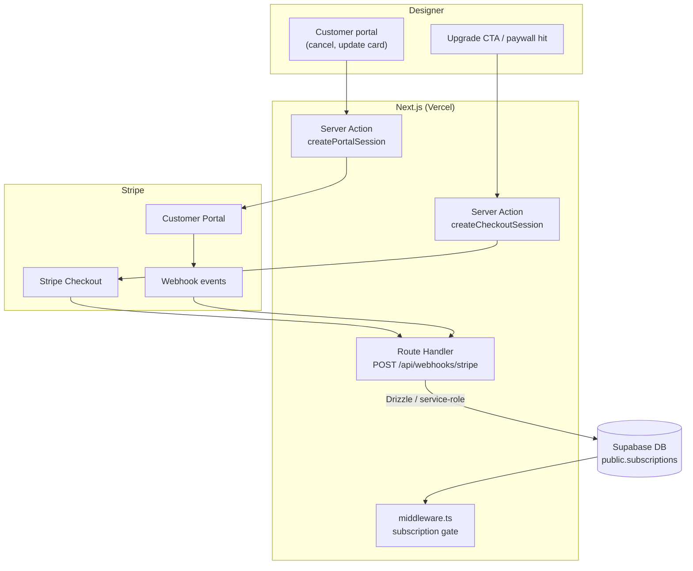

# Billing

End-to-end architecture for Stripe billing: subscription model, checkout, webhooks, trial/lapse states, and failure handling. This is the authoritative doc for the billing subsystem — other docs reference here for anything beyond column-level detail.

---

## Overview



---

## Subscription model

### Plans

Pro is offered in two billing intervals (monthly / annual) and two currencies (**USD / CAD**). All four resulting prices sit under a single Stripe **Speclyy Pro** product — adding new regions never creates new products, only new prices on the same product.

| Plan | Currency | Price | Stripe env var | Features |
|---|---|---|---|---|
| Free | — | $0 | — (no Stripe record) | Full app access; PDF export gated (blurred preview) |
| Pro Monthly | USD | $37/mo | `STRIPE_PRICE_ID_PRO_MONTHLY_USD` | PDF + shareable link export |
| Pro Annual | USD | $29/mo billed annually ($348/yr — ~22% off) | `STRIPE_PRICE_ID_PRO_ANNUAL_USD` | PDF + shareable link export |
| Pro Monthly | CAD | CA$49/mo | `STRIPE_PRICE_ID_PRO_MONTHLY_CAD` | PDF + shareable link export |
| Pro Annual | CAD | CA$39/mo billed annually (CA$468/yr — ~20% off) | `STRIPE_PRICE_ID_PRO_ANNUAL_CAD` | PDF + shareable link export |

> CAD prices are **clean local numbers** — not FX-converted from USD. They stay stable regardless of exchange-rate drift. Future markets (INR, AED, etc.) follow the same pattern: new prices on the same product, never new products.
>
> Price IDs are read through a single `apps/web/src/lib/billing/plans.ts` module exposing a currency-keyed `PLANS[currency][interval]` map. Both `interval` (monthly/annual) and `currency` (USD/CAD) are passed from the client through `createProSubscription` and resolved server-side.

### Subscription states

Free users have no row in `subscriptions`. Pro users have a Stripe-backed row.

| Stripe status | `subscriptions.status` | PDF export |
|---|---|---|
| *(no row)* | — | Blocked — blurred preview shown |
| `active` | `active` | Allowed |
| `past_due` | `past_due` | Blocked — upgrade prompt shown |
| `canceled` | `canceled` | Blocked — upgrade prompt shown |
| `incomplete` | `incomplete` | Blocked (payment not confirmed) |
| `incomplete_expired` | `incomplete_expired` | Blocked |

The app-wide middleware gate is removed. Access control lives at the export action: if the user has no active subscription, the PDF render returns a blurred preview and an upgrade CTA instead of a download.

The `subscriptions` table also carries a `currency text not null default 'USD'` column (`CHECK IN ('USD','CAD')`, extensible) recording the user's chosen currency at subscription time. Currency is fixed for the life of a subscription — switching requires cancel + re-subscribe.

---

## Currency & regional pricing

### Supported currencies

USD (default fallback) and CAD. The architecture supports adding more with no schema changes — a new currency is a new pair of price IDs in Stripe plus a new entry in the `PLANS` map.

### Detection

The plan screen detects a default currency server-side at first render:

1. **Vercel geo header** — `x-vercel-ip-country` from edge: `CA` → CAD; anything else → USD.
2. **`Accept-Language` fallback** — used when the geo header is absent (local dev). `en-CA` → CAD; otherwise USD.

```ts
// apps/web/src/lib/billing/detect-currency.ts
export function detectDefaultCurrency(): 'USD' | 'CAD' {
  const h = headers()
  const country = h.get('x-vercel-ip-country')?.toUpperCase()
  if (country === 'CA') return 'CAD'
  if (country === 'US') return 'USD'
  const lang = h.get('accept-language') ?? ''
  return /\ben-CA\b/i.test(lang) ? 'CAD' : 'USD'
}
```

### Override

A 🇺🇸 USD / 🇨🇦 CAD segmented toggle on the plan screen lets the user override the detected default. The chosen currency is persisted in `sessionStorage` only — never cookies, since the next visitor on the same browser should re-detect from their own geo.

### Server-side resolution

`createProSubscription(interval, currency)` resolves the price via:

```ts
const { priceId } = PLANS[currency][interval]
```

The `currency` param is passed through Stripe Subscription metadata (`metadata: { userId, currency }`) so the webhook handler can persist it deterministically. Stripe's own `subscription.currency` is the fallback source if metadata is missing.

### Billing-address validation

After `confirmPayment`, before treating the subscription as successful:

| Subscription currency | Required billing-address country |
|---|---|
| **CAD** | `CA` (strict — this is the discount-eligibility gate) |
| **USD** | Any country (permissive — USD is the international fallback) |

A mismatch (CAD selected, non-CA billing) cancels the incomplete subscription via `stripe.subscriptions.cancel(id)` and surfaces an inline error. No charge occurs.

The strict gate only applies to CAD because the USD↔CAD spread is small (~30%) and USD is the universal fallback. Future markets with steeper PPP discounts (INR, AED) will require **card-issuer (BIN) country validation** in addition to billing address — see Open questions.

### Stripe Tax

`automatic_tax: { enabled: true }` is set on every Subscription create. For Canadian customers, Stripe Tax computes federal GST/HST and applicable provincial taxes (Ontario HST 13%, BC GST 5% + PST 7%, etc.) using the registered Canadian tax IDs in Stripe Tax → Registrations. Tax is line-itemed on the invoice; no app code formats it.

US-state tax is not configured — defer until Speclyy crosses an economic-nexus threshold in any state.

### Switching currencies post-subscription

Not supported in-app or in the customer portal. Users cancel via the portal and re-subscribe with the new currency selected. The help-doc at [`/help/billing/changing-currency`](/help/billing/changing-currency) documents the flow and is linked from the account-settings billing CTA and the Pro Success screen.

---

## Checkout flow

Rendered inline using **Stripe Elements** — no redirect to Stripe's domain. See [ADR-0018](adr/0018-payment-surface.md) for rationale.

### Entry points

- **Onboarding step 4 (Plan)** — selecting Pro → `/onboarding/checkout`
- **PDF export paywall** — upgrade CTA on blurred preview
- **Upgrade CTA** — account settings

### Server: create subscription + return `client_secret`

```ts
// app/(billing)/billing/actions.ts
'use server'
export async function createProSubscription(
  interval: 'monthly' | 'annual',
  currency: 'USD' | 'CAD',
) {
  const supabase = createServerClient(...)
  const { data: { user } } = await supabase.auth.getUser()

  // Reuse or create Stripe customer
  const { data: existing } = await supabase
    .from('subscriptions')
    .select('stripe_customer_id')
    .eq('user_id', user.id)
    .maybeSingle()

  const customerId = existing?.stripe_customer_id
    ?? (await stripe.customers.create({
          email: user.email!,
          metadata: { userId: user.id },
        })).id

  const { priceId } = PLANS[currency][interval]  // currency-keyed resolution

  const subscription = await stripe.subscriptions.create({
    customer: customerId,
    items: [{ price: priceId }],
    payment_behavior: 'default_incomplete',
    payment_settings: { save_default_payment_method: 'on_subscription' },
    automatic_tax: { enabled: true },                     // Stripe Tax (CA today, US-states later)
    expand: ['latest_invoice.payment_intent'],
    metadata: { userId: user.id, currency },              // currency persisted via metadata
  })

  const clientSecret = (subscription.latest_invoice as Stripe.Invoice)
    .payment_intent as Stripe.PaymentIntent
  return { clientSecret: clientSecret.client_secret!, subscriptionId: subscription.id }
}
```

### Server → client: `clientSecret` hand-off

The `clientSecret` returned by `createProSubscription` is a one-use capability. Pass it from the Server Action (plan step) to the checkout page via an **HttpOnly cookie** — never a URL / query string:

- Name: `speclyy_cs`
- Flags: `HttpOnly`, `Secure`, `SameSite=Lax`
- `path=/onboarding/checkout`, `maxAge=600` (10 minutes)
- Single-use: the checkout page reads it server-side and clears it on first render. A reload without a fresh cookie redirects back to `/onboarding/plan`.

This keeps the secret out of Referer headers, browser history, and server access logs.

### Client: mount PaymentElement + confirm

```tsx
// app/(billing)/checkout/CheckoutForm.tsx
'use client'
const stripe = useStripe()
const elements = useElements()

async function onSubmit() {
  const { error } = await stripe!.confirmPayment({
    elements: elements!,
    confirmParams: { return_url: `${origin}/billing/success` },
  })
  // error.message rendered inline; success path handled by webhook + return_url
}
```

### Success / cancel return

- `/billing/success` — renders the Pro Success screen. Confirms `subscriptions.status = 'active'` before showing; if the webhook is still in flight (rare, <2s), shows a "finalizing…" state and polls.
- User cancel (closes tab / back) — the `incomplete` subscription remains in Stripe and expires automatically via Stripe's `incomplete_expired` after 23h. No cleanup needed.

No business logic on the return URL — all state changes happen via webhook.

---

## Customer portal

```ts
export async function createPortalSession() {
  const { data: sub } = await supabase
    .from('subscriptions')
    .select('stripe_customer_id')
    .eq('user_id', user.id)
    .single()

  const session = await stripe.billingPortal.sessions.create({
    customer: sub.stripe_customer_id,
    return_url: `${process.env.NEXT_PUBLIC_APP_URL}/billing`,
  })

  redirect(session.url!)
}
```

Users can: cancel subscription, update payment method, view invoice history. Plan switching is disabled until multi-plan is supported. **Currency switching is not supported in-portal** — the help-doc at [`/help/billing/changing-currency`](/help/billing/changing-currency) (linked from the account-settings billing CTA) explains the cancel-and-re-subscribe flow.

All actions taken in the portal fire webhook events (`customer.subscription.updated`, `customer.subscription.deleted`) which reconcile the DB — no separate reconciliation needed.

---

## Webhook handling

### Endpoint

`POST /api/webhooks/stripe` — verified via `stripe.webhooks.constructEvent` before any processing.

```ts
// app/api/webhooks/stripe/route.ts
export async function POST(req: Request) {
  const body = await req.text()
  const sig = req.headers.get('stripe-signature')!

  let event: Stripe.Event
  try {
    event = stripe.webhooks.constructEvent(body, sig, process.env.STRIPE_WEBHOOK_SECRET!)
  } catch {
    return new Response('Invalid signature', { status: 400 })
  }

  await processEvent(event)  // idempotent
  return new Response('ok')
}
```

### Event taxonomy

| Event | Action |
|---|---|
| `customer.subscription.created` | Upsert subscription row with initial `status` (usually `incomplete`) |
| `customer.subscription.updated` | Update `status`, `current_period_end` |
| `customer.subscription.deleted` | Set `status = canceled` |
| `invoice.paid` / `invoice.payment_succeeded` | Set `status = active`, update `current_period_end` |
| `invoice.payment_failed` | Set `status = past_due` |
| `payment_intent.succeeded` | Informational; reconcile only if subscription.updated hasn't arrived |

`checkout.session.completed` is no longer used — we moved from hosted Checkout to embedded Elements ([ADR-0018](adr/0018-payment-surface.md)). `trial_ends_at` removed — free plan is indefinite, no trial.

### Idempotency

Each handler uses `stripe_event_id` (the Stripe event's `id` field) to dedup. The `processed_webhook_events` table stores seen event IDs:

```sql
CREATE TABLE public.processed_webhook_events (
  stripe_event_id text PRIMARY KEY,
  processed_at    timestamptz NOT NULL DEFAULT now()
);
```

On each incoming event: `INSERT ... ON CONFLICT DO NOTHING` returns `0 rows affected` → skip. This makes every handler safe to replay.

### Out-of-order events

Stripe does not guarantee delivery order. All handlers are idempotent and use `updated_at`-guarded upserts:

```ts
const currency =
  (event.data.object.metadata?.currency as 'USD' | 'CAD' | undefined) ??
  event.data.object.currency.toUpperCase()  // fallback to Stripe's denomination

await db
  .insert(subscriptions)
  .values({ userId, status, currency, currentPeriodEnd, ... })
  .onConflictDoUpdate({
    target: subscriptions.userId,
    set: { status, currency, currentPeriodEnd, updatedAt: new Date() },
    where: sql`subscriptions.updated_at < ${new Date()}`,
  })
```

`subscriptions.user_id` carries a `UNIQUE` constraint (see [auth.md § Data model](auth.md#data-model)) — it's both the MVP one-subscription-per-user invariant ([ADR-0017](adr/0017-subscription-ownership.md)) and the conflict target this upsert relies on.

A `past_due` event arriving after `active` (due to retry) will not overwrite the newer `active` state.

### Stripe's own retries

Stripe retries failed webhook deliveries (non-2xx response) with exponential backoff over 3 days. Idempotency dedup ensures replays are safe.

---

## Free vs Pro gating

### Gate location

The gate is **not** in middleware. It lives inside the PDF export server action:

```ts
// app/(export)/export/actions.ts
export async function exportSpecPDF(projectId: string) {
  const supabase = createServerClient(...)
  const { data: { user } } = await supabase.auth.getUser()

  const { data: sub } = await supabase
    .from('subscriptions')
    .select('status')
    .eq('user_id', user.id)
    .maybeSingle()  // free users have no row

  const isPro = sub?.status === 'active'
  if (!isPro) {
    return { gated: true }  // client renders blurred preview + upgrade CTA
  }

  // ... generate and return PDF
}
```

### Blurred preview

When `gated: true` is returned, the client renders the PDF preview with a CSS blur filter and overlays an upgrade CTA. The designer sees the layout of their spec — enough to know the output is valuable — but cannot download it.

### What gets locked

Only PDF export and shareable link export are gated. All other features (projects, specs, product library, URL extraction) remain fully accessible on the free plan indefinitely. Project data is never deleted.

### Lapsed Pro (payment failure)

If a Pro subscription lapses (`past_due`, `canceled`), the user reverts to free plan behaviour — PDF export is gated again. Stripe handles dunning (retry emails) independently.

---

## Promo codes

Promo codes use Stripe Promotion Codes (not raw coupons). Codes are created in the Stripe dashboard and attached to a coupon (e.g. 30% off first 3 months).

`allow_promotion_codes: true` on the Checkout session exposes a promo code field to the user. Validation and application are handled by Stripe — no custom code needed.

`promo_code_id` on the `subscriptions` row is reserved for future internal tracking (not yet populated).

---

## Failure handling

### Webhook processing failures

If the handler throws, the endpoint returns 5xx → Stripe retries. For errors that are not transient (e.g. bad data), the handler logs to Axiom with the raw event payload and returns 200 to prevent Stripe retry storms, then alerts via Axiom monitor.

### Stripe API outages

Checkout and portal session creation are user-initiated. If Stripe is down, the Server Action throws and the UI shows a generic error. No queuing — the user retries manually.

### Reconciliation

A weekly Inngest cron job cross-checks `subscriptions` rows against Stripe's API for accounts with recent activity. If drift is detected (e.g. a missed webhook), it corrects the DB and logs the discrepancy to Axiom.

---

## Observability

Key metrics tracked in Axiom:

| Metric | Alert threshold |
|---|---|
| Webhook processing lag | > 30s p95 |
| Failed payment rate | > 5% of invoices in 24h |
| Webhook 5xx rate | any in 1h |
| Trial-to-paid conversion | dashboard only |

See [operations.md](operations.md) for the full observability setup.

---

## Open questions

- **Stripe Tax — US states.** Enabled and registered for Canada (CRA federal GST/HST + applicable provincial). Not yet configured for US-state nexus — defer until Speclyy crosses an economic-nexus threshold in any state, then register state-by-state.
- **Card-issuer (BIN) country validation.** Deferred. Today, the CAD discount is gated only by billing-address country. The USD↔CAD spread is small enough that VPN/billing-address arbitrage isn't a meaningful threat. When introducing markets with deep PPP discounts (INR ~$10/mo, AED, etc.), add card-BIN country validation to the checkout flow as a second gate.
- **Geo-detection accuracy.** Vercel's `x-vercel-ip-country` is the primary signal for currency default. If it misfires for users on cross-border ISPs, the on-screen toggle is the user-facing answer. Telemetry to confirm: log toggle-flip events with `{ detected, chosen }`; revisit detection if agreement drifts below ~95%.
- **Plan switching (monthly ↔ annual)** — post-MVP. At MVP, designers pick an interval at checkout; changing interval requires canceling and re-subscribing via the customer portal.
- **Currency switching post-subscription** — same cancel + re-subscribe pattern as plan switching; documented in `/help/billing/changing-currency`.
- **Additional gated features** — shareable link export is gated at the action level, same pattern as PDF export.
- **Team / seat billing** — not in scope for MVP.

---

## References

- [auth.md](auth.md) — subscription gate in middleware
- [database.md](database.md) — `subscriptions` schema
- [security.md](security.md) — webhook signature verification, service-role key handling
- [operations.md](operations.md) — webhook lag alerts, billing dashboards
