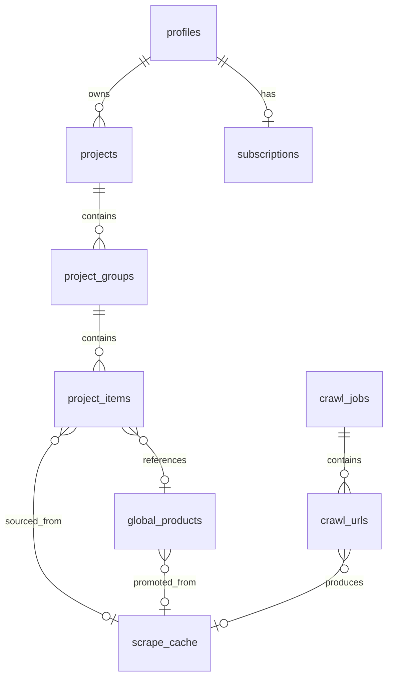

# Database — Architecture

How the Postgres database is structured, accessed, and maintained. For the *why* behind engine and host decisions, see [ADR-0003](adr/0003-database-engine.md), [ADR-0004](adr/0004-postgres-host.md), and [ADR-0008](adr/0008-orm.md).

---

## Overview



---

## Schema

> **Status:** `profiles` and `subscriptions` are locked (ADR-0007). The remaining tables are designed from the PRD and screen inventory — they will be formalised in the database deep-dive session before implementation.

### `auth.users` (Supabase-managed)
Do not modify. Contains: `id`, `email`, OAuth identity metadata, timestamps.

---

### `public.profiles`
One row per user. Created automatically by trigger on `auth.users` insert.

```sql
CREATE TABLE public.profiles (
  id                      uuid PRIMARY KEY REFERENCES auth.users(id) ON DELETE CASCADE,
  first_name              text,
  last_name               text,
  studio_name             text,
  market                  text CHECK (market IN ('los_angeles','new_york','dallas','calgary')),
  onboarding_completed_at timestamptz,
  is_onboarded            boolean GENERATED ALWAYS AS (onboarding_completed_at IS NOT NULL) STORED,
  created_at              timestamptz NOT NULL DEFAULT now(),
  updated_at              timestamptz NOT NULL DEFAULT now()
);
CREATE INDEX profiles_is_onboarded_idx ON public.profiles (is_onboarded);
```

---

### `public.subscriptions`
Trial and Stripe billing state. Written by the Stripe webhook handler only.

```sql
CREATE TABLE public.subscriptions (
  id                       uuid PRIMARY KEY DEFAULT gen_random_uuid(),
  user_id                  uuid NOT NULL REFERENCES public.profiles(id) ON DELETE CASCADE,
  status                   text NOT NULL CHECK (status IN (
                             'trialing','active','past_due','canceled',
                             'incomplete','incomplete_expired')),
  trial_ends_at            timestamptz,
  current_period_end       timestamptz,
  stripe_customer_id       text UNIQUE,
  stripe_subscription_id   text UNIQUE,
  promo_code_id            uuid,
  created_at               timestamptz NOT NULL DEFAULT now(),
  updated_at               timestamptz NOT NULL DEFAULT now()
);
CREATE INDEX subscriptions_user_id_idx          ON public.subscriptions (user_id);
CREATE INDEX subscriptions_stripe_customer_idx  ON public.subscriptions (stripe_customer_id);
```

---

### `public.projects`
Top-level workspace per designer.

```sql
CREATE TABLE public.projects (
  id          uuid PRIMARY KEY DEFAULT gen_random_uuid(),
  owner_id    uuid NOT NULL REFERENCES public.profiles(id) ON DELETE CASCADE,
  name        text NOT NULL,
  client_name text,
  address     text,
  created_at  timestamptz NOT NULL DEFAULT now(),
  updated_at  timestamptz NOT NULL DEFAULT now()
);
CREATE INDEX projects_owner_id_idx ON public.projects (owner_id);
```

---

### `public.project_groups`
Free-form named sections within a project (e.g. "Master Ensuite", "Plumbing Fixtures"). No enforced taxonomy — designer names them anything.

```sql
CREATE TABLE public.project_groups (
  id         uuid PRIMARY KEY DEFAULT gen_random_uuid(),
  project_id uuid NOT NULL REFERENCES public.projects(id) ON DELETE CASCADE,
  name       text NOT NULL,
  position   int NOT NULL DEFAULT 0,  -- designer-defined order, preserved in PDF export
  created_at timestamptz NOT NULL DEFAULT now(),
  updated_at timestamptz NOT NULL DEFAULT now()
);
CREATE INDEX project_groups_project_id_idx ON public.project_groups (project_id);
```

---

### `public.project_items`
Product selections. Every item belongs to a group. All fields except `product_name` are optional — partial data is a valid, expected state.

```sql
CREATE TABLE public.project_items (
  id                uuid PRIMARY KEY DEFAULT gen_random_uuid(),
  group_id          uuid NOT NULL REFERENCES public.project_groups(id) ON DELETE CASCADE,
  project_id        uuid NOT NULL REFERENCES public.projects(id) ON DELETE CASCADE,

  -- product fields
  product_name      text NOT NULL,
  brand             text,
  collection        text,
  finish            text,
  sku               text,
  colour            text,
  material          text,
  dimensions        jsonb,          -- { width, height, depth, unit }
  product_url       text,
  image_url         text,
  notes             text,
  status            text NOT NULL CHECK (status IN ('complete','tbd')) DEFAULT 'tbd',

  -- source tracking
  source            text CHECK (source IN ('library','url','manual')) DEFAULT 'manual',
  global_product_id uuid REFERENCES public.global_products(id),
  scrape_cache_id   uuid REFERENCES public.scrape_cache(id),

  created_at        timestamptz NOT NULL DEFAULT now(),
  updated_at        timestamptz NOT NULL DEFAULT now()
);
CREATE INDEX project_items_group_id_idx   ON public.project_items (group_id);
CREATE INDEX project_items_project_id_idx ON public.project_items (project_id);
CREATE INDEX project_items_status_idx     ON public.project_items (status)
  WHERE status = 'tbd';  -- partial index — frequent "show me TBDs" query
```

---

### `public.global_products`
The curated, trusted product library. Seeded manually for MVP; promoted from scrape results via internal review.

```sql
CREATE TABLE public.global_products (
  id           uuid PRIMARY KEY DEFAULT gen_random_uuid(),
  brand        text NOT NULL,
  collection   text,
  product_name text NOT NULL,
  finishes     text[],            -- ['Stainless', 'Matte Black', 'Champagne Bronze']
  sku          text,
  dimensions   jsonb,
  product_url  text,
  image_url    text,
  category     text,              -- 'plumbing', 'paint', 'tile', 'hardware', ...
  markets      text[],            -- null = global; ['los_angeles','new_york'] = local only
  status       text NOT NULL CHECK (status IN ('active','discontinued','pending_review'))
               DEFAULT 'active',
  created_at   timestamptz NOT NULL DEFAULT now(),
  updated_at   timestamptz NOT NULL DEFAULT now()
);
CREATE INDEX global_products_brand_idx    ON public.global_products (brand);
CREATE INDEX global_products_category_idx ON public.global_products (category);
CREATE INDEX global_products_status_idx   ON public.global_products (status);

-- Full-text search index (covers brand + collection + product_name)
CREATE INDEX global_products_fts_idx ON public.global_products
  USING gin(to_tsvector('english', coalesce(brand,'') || ' ' ||
                                   coalesce(collection,'') || ' ' ||
                                   coalesce(product_name,'')));
```

---

### `public.scrape_cache`
Deduplicates scrape requests — same URL hit by multiple designers triggers one scrape. Also serves as the primary failure log: every failed attempt is recorded here with a structured `error_type` so the admin can see which domains need fixes.

```sql
CREATE TABLE public.scrape_cache (
  id                  uuid PRIMARY KEY DEFAULT gen_random_uuid(),
  url_hash            text UNIQUE NOT NULL,   -- SHA-256 of normalised URL
  url                 text NOT NULL,
  status              text CHECK (status IN ('pending','success','failed')),
  extracted_data      jsonb,                  -- raw Claude output
  error_message       text,                  -- raw exception message
  error_type          text CHECK (error_type IN (
                        'tos_blocked','anti_bot','timeout','invalid_url','claude_error',
                        'network_error','parse_error','image_upload_error','unknown'
                      )),
  attempts            int NOT NULL DEFAULT 0,
  last_attempted_at   timestamptz,
  scrape_duration_ms  int,
  created_at          timestamptz NOT NULL DEFAULT now(),
  expires_at          timestamptz NOT NULL DEFAULT (now() + interval '90 days')
                                          -- default TTL; overridden per domain in scraper/config/domains.ts
                                          -- (stable domains → 1y, volatile domains → 14d)
);
CREATE INDEX scrape_cache_expires_at_idx  ON public.scrape_cache (expires_at);
CREATE INDEX scrape_cache_url_hash_idx    ON public.scrape_cache (url_hash);
CREATE INDEX scrape_cache_status_idx      ON public.scrape_cache (status);
CREATE INDEX scrape_cache_error_type_idx  ON public.scrape_cache (error_type)
  WHERE error_type IS NOT NULL;
```

---

### `public.crawl_jobs`
Top-level bulk crawl campaigns. One row per admin-initiated brand crawl. Written by the admin API, updated by the scraper as URLs are processed.

```sql
CREATE TABLE public.crawl_jobs (
  id                   uuid PRIMARY KEY DEFAULT gen_random_uuid(),
  brand                text NOT NULL,
  domain               text NOT NULL,
  status               text NOT NULL CHECK (status IN (
                         'pending','discovering','crawling','paused','completed','failed')),
  total_urls           int NOT NULL DEFAULT 0,
  processed_urls       int NOT NULL DEFAULT 0,
  succeeded_urls       int NOT NULL DEFAULT 0,
  failed_urls          int NOT NULL DEFAULT 0,
  duration_days        int NOT NULL DEFAULT 10,
  rate_limit_ms        int NOT NULL DEFAULT 8000,
  started_at           timestamptz,
  completed_at         timestamptz,
  estimated_completion timestamptz,
  notes                text,
  created_at           timestamptz NOT NULL DEFAULT now()
);
```

---

### `public.crawl_urls`
One row per discovered product URL within a crawl job. Provides resumability — on restart, the scraper picks up `status = 'pending'` rows.

```sql
CREATE TABLE public.crawl_urls (
  id              uuid PRIMARY KEY DEFAULT gen_random_uuid(),
  crawl_job_id    uuid NOT NULL REFERENCES public.crawl_jobs(id) ON DELETE CASCADE,
  url             text NOT NULL,
  url_hash        text NOT NULL,
  status          text NOT NULL CHECK (status IN (
                    'pending','in_progress','success','failed','skipped')),
  attempts        int NOT NULL DEFAULT 0,
  error_message   text,
  scrape_cache_id uuid REFERENCES public.scrape_cache(id),
  processed_at    timestamptz,
  created_at      timestamptz NOT NULL DEFAULT now()
);
CREATE INDEX crawl_urls_job_status_idx ON public.crawl_urls (crawl_job_id, status);
CREATE INDEX crawl_urls_url_hash_idx   ON public.crawl_urls (url_hash);
```

RLS: `crawl_jobs` and `crawl_urls` are admin-only tables — no user-facing RLS policies. Readable and writable via service-role key (Drizzle) only.

---

## Dual-client pattern

Two query clients serve different purposes:

| Client | When | Auth context | RLS |
|---|---|---|---|
| **Supabase JS** (`createServerClient`) | RSC + Server Actions — user-facing queries | User JWT via cookie | ✅ Enforced |
| **Drizzle** (`db`) | Stripe webhooks, Inngest callbacks, background jobs | Service-role DB URL | ❌ Bypassed |

```ts
// lib/supabase/server.ts — user-facing, RLS enforced
import { createServerClient } from '@supabase/ssr'
import { cookies } from 'next/headers'

export function createSupabaseServerClient() {
  return createServerClient(
    process.env.NEXT_PUBLIC_SUPABASE_URL!,
    process.env.NEXT_PUBLIC_SUPABASE_ANON_KEY!,
    { cookies: { getAll: () => cookies().getAll(), setAll: ... } }
  )
}

// lib/db.ts — internal, service-role, RLS bypassed
import { drizzle } from 'drizzle-orm/postgres-js'
import postgres from 'postgres'
import * as schema from './schema'

const client = postgres(process.env.DATABASE_URL_POOLED!)
export const db = drizzle(client, { schema })
```

**Rule:** Never use `db` (Drizzle) in an RSC or Server Action that handles user requests — it bypasses RLS. Only use it in Route Handlers and background jobs where the service role is explicitly correct.

---

## Migration workflow

> **Greenfield today.** No Supabase project is provisioned yet and no production data exists. The first "migration" Drizzle generates *is* the initial schema — auth tables, subscriptions, `processed_webhook_events`, and the per-app tables all land together or in the first few migrations, without the usual "add column nullable, backfill, then NOT NULL" dance. Treat the workflow below as the steady-state pattern once we're live.

```bash
# 1. Edit schema in lib/db/schema.ts
# 2. Generate migration — produces a readable .sql file
npx drizzle-kit generate

# 3. Review the generated SQL in drizzle/migrations/
# 4. Apply to local Supabase
npx drizzle-kit migrate

# 5. Apply to production (same command, DATABASE_URL pointing at prod)
DATABASE_URL=$PROD_URL npx drizzle-kit migrate
```

Migrations are committed to `drizzle/migrations/` and reviewed in PRs before being applied to production. The SQL file shows exactly what DDL runs — no magic.

---

## Row-Level Security

All `public.*` tables have RLS enabled. Pattern:

```sql
-- Every user-owned table
ALTER TABLE public.projects ENABLE ROW LEVEL SECURITY;

CREATE POLICY "projects: owner read" ON public.projects
  FOR SELECT USING (owner_id = auth.uid());

CREATE POLICY "projects: owner write" ON public.projects
  FOR ALL USING (owner_id = auth.uid()) WITH CHECK (owner_id = auth.uid());

-- Child tables: access via parent ownership
ALTER TABLE public.project_groups ENABLE ROW LEVEL SECURITY;

CREATE POLICY "project_groups: via project" ON public.project_groups
  FOR ALL USING (
    project_id IN (
      SELECT id FROM public.projects WHERE owner_id = auth.uid()
    )
  );
```

`global_products` and `scrape_cache` are readable by all authenticated users, writable only via service-role (Drizzle in background jobs):

```sql
ALTER TABLE public.global_products ENABLE ROW LEVEL SECURITY;

CREATE POLICY "global_products: authenticated read" ON public.global_products
  FOR SELECT TO authenticated USING (status = 'active');

-- No user INSERT/UPDATE — written only by service-role (Drizzle)
```

---

## Key query patterns

### Project overview — groups with TBD count
```ts
const groups = await supabase
  .from('project_groups')
  .select(`
    id, name, position,
    project_items(count),
    tbd:project_items(count).filter(status.eq.tbd)
  `)
  .eq('project_id', projectId)
  .order('position')
```

### Library search — full-text + trigram
```ts
const results = await supabase
  .from('global_products')
  .select('*')
  .textSearch('fts', query, { type: 'websearch' })
  .eq('status', 'active')
  .limit(20)
```

### Check scrape cache before enqueuing
```ts
const hash = sha256(normaliseUrl(url))
const cached = await db
  .select()
  .from(scrapeCache)
  .where(eq(scrapeCache.urlHash, hash))
  .limit(1)
```

---

## Connection management

- **Serverless (Next.js on Vercel):** use the pooled connection string (`DATABASE_URL_POOLED`) → goes through Supabase's Supavisor pooler in transaction mode. Each serverless invocation gets a pooled connection; no persistent connections.
- **Long-running (scraper on Fly.io):** use the direct connection string (`DATABASE_URL`) → persistent connection, no pooler overhead.
- **Local dev:** use the local Supabase instance connection string.

---

## References

- [ADR-0003 — Database engine: Postgres](adr/0003-database-engine.md)
- [ADR-0004 — Postgres host: Supabase](adr/0004-postgres-host.md)
- [ADR-0007 — Auth data model and middleware gates](adr/0007-auth-data-model.md)
- [ADR-0008 — ORM: Drizzle](adr/0008-orm.md)
- [auth.md](auth.md) — `profiles` and `subscriptions` table details
- [scraper/on-demand.md](scraper/on-demand.md) — `scrape_cache` usage in on-demand flow
- [scraper/failure-tracking.md](scraper/failure-tracking.md) — `error_type`, `attempts` fields detail
