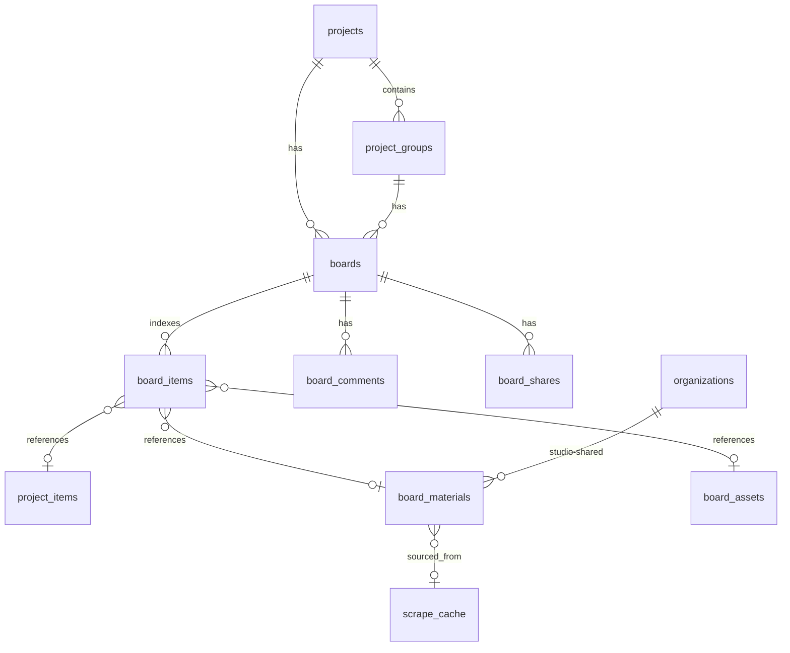

# Moodboard — Architecture

The Moodboard studio is a freeform canvas workspace for designers to compose visual boards — paint chips, fabric swatches, real product photos, scraped images, designer uploads, and sticky notes — anchored to a project or a project group. It deploys as a sister Next.js app (`apps/moodboard`, separate Vercel project) behind the same auth on `.speclyy.com`.

---

## Headline decisions

| #   | Decision                                                                                                                                     | Rationale                                                                                                         |
| --- | -------------------------------------------------------------------------------------------------------------------------------------------- | ----------------------------------------------------------------------------------------------------------------- |
| 1   | Boards attach to **project OR project_group** (`parent_kind` discriminator)                                                                  | Designers can compose at the project scale ("the whole house concept") or the group scale ("master ensuite")      |
| 2   | **Two tables** — `boards` (the document) + `board_items` (queryable index)                                                                   | Items reference existing `project_items` _or_ are standalone moodboard-only `board_materials`                     |
| 3   | Board canvas state is a **JSONB document** on `boards.document` — Canva-style portable format                                                | Enables import/export of boards as a single file, cheap revisions, AI-friendly schema, future undo/redo           |
| 4   | **Sharing**: team read/write, client read-only with comments                                                                                 | Two share modes: studio members (org membership) and signed public links scoped to a board                        |
| 5   | **No realtime collab v1** — single editor, autosave with last-writer-wins                                                                    | Provision Supabase Realtime channels in the schema so we can layer presence + multiplayer later without migration |
| 6   | **Library union**: `global_products` + designer's prior `project_items` + studio-shared `board_materials` + URL-paste-now (existing scraper) | Same scraper pipeline already in production                                                                       |
| 7   | **Assets**: products, scrapes, designer uploads, procedural swatches. **No AI imagery.**                                                     | New Supabase Storage bucket `board-uploads`; reuse existing `product-images` for scraped/global imagery           |
| 8   | **Exports**: PNG, PDF (moodboard), PDF (spec sheet), shareable link, Canva-compatible (PDF/PNG/SVG download)                                 | Server-side render via Playwright (already in scraper), reuses the same browser pool                              |
| 9   | **Sub-app** at `moodboard.speclyy.com` (Vercel) — same Supabase project, same auth cookie domain                                             | Independent release cadence, isolates heavy canvas deps from the main bundle                                      |
| 10  | **AI is a future provision**, not v1 — but the document schema is deterministic JSON so AI can read/write it later                           | Ship fast                                                                                                         |

---

## What it does

```
┌──────────────┬──────────────────────────────┬───────────────┐
│  Sidebar     │          Canvas              │   Library     │
│              │                              │               │
│  brief       │  freeform paper, drag /      │  global_      │
│  palette     │  resize / rotate / z-order   │  products     │
│  rooms       │                              │  + my items   │
│  activity    │  items:                      │  + studio     │
│  comments    │   - product (scraped/global) │  + URL paste  │
│              │   - swatch (paint hex)       │               │
│              │   - photo (uploaded)         │  drag → drop  │
│              │   - note (sticky)            │  on canvas    │
│              │   - text (heading)           │               │
└──────────────┴──────────────────────────────┴───────────────┘
```

Designers build boards. Boards ship as **PNG**, **PDF**, **shareable web link**, or feed the spec-sheet PDF. Clients open share links to view + comment. Other studio members read/write.

---

## High-level architecture

```mermaid
flowchart TB
  subgraph Browser["Browser — moodboard.speclyy.com"]
    Studio[Studio shell\nSidebar / Canvas / Library]
    DocStore[Board document\n in-memory React state]
    Saver[Debounced autosaver]
  end

  subgraph MB["apps/moodboard (Vercel)"]
    Page[RSC shell\nfetches board + parents + comments]
    SA[Server Actions\nsaveBoard / addItem / addComment\nuploadAsset / createShareLink / export]
    RH[Route Handlers\n/share/[token] (public read)\n/api/render (PNG/PDF)]
  end

  subgraph Web["apps/web (existing app)"]
    Project[/projects/[id] page\ndeep-links to board/]
    SpecSheet[Spec sheet PDF\nreads board_items]
  end

  subgraph SB["Supabase"]
    DB[(Postgres\n boards · board_items · board_materials\n board_assets · board_comments · board_shares)]
    ST[(Storage\n board-uploads bucket)]
    RT[Realtime\n boards channel — provisioned]
    AU[Auth\n shared cookie .speclyy.com]
  end

  subgraph Ext["External"]
    Scraper["Scraper (Fly.io)\nURL paste + render server"]
    Inngest
  end

  Browser --> Page
  Studio --> DocStore --> Saver --> SA --> DB
  SA --> ST
  SA --> Inngest --> Scraper
  Project --> Browser
  SpecSheet -.reads.-> DB
  RH --> Scraper
  RT -.provisioned.- Browser
  AU --> Browser
```

---

## Data model



### `boards`

The board itself. `parent_kind` discriminates: a board attaches to either a project (concept-level) or a project_group (room-level).

```sql
CREATE TABLE public.boards (
  id          uuid PRIMARY KEY DEFAULT gen_random_uuid(),
  owner_id    uuid NOT NULL REFERENCES public.profiles(id),
  org_id      uuid REFERENCES public.organizations(id),  -- null for solo
  parent_kind text NOT NULL CHECK (parent_kind IN ('project','group')),
  project_id  uuid NOT NULL REFERENCES public.projects(id) ON DELETE CASCADE,
  group_id    uuid REFERENCES public.project_groups(id) ON DELETE CASCADE,
  name        text NOT NULL,
  brief       text,
  palette     jsonb NOT NULL DEFAULT '[]'::jsonb,  -- [{hex, source: 'auto'|'manual', label?}]
  document    jsonb NOT NULL DEFAULT '{"v":1,"items":[]}'::jsonb,
  rev         int NOT NULL DEFAULT 1,
  thumbnail_url text,
  created_at  timestamptz NOT NULL DEFAULT now(),
  updated_at  timestamptz NOT NULL DEFAULT now(),
  CONSTRAINT board_parent_consistent CHECK (
    (parent_kind = 'project' AND group_id IS NULL) OR
    (parent_kind = 'group'   AND group_id IS NOT NULL)
  )
);
CREATE INDEX boards_project_idx ON public.boards (project_id);
CREATE INDEX boards_group_idx   ON public.boards (group_id) WHERE group_id IS NOT NULL;
```

### `board_items`

Denormalized index over `boards.document.items`. Rebuilt on every save (idempotent upsert keyed on `(board_id, item_id)`). Lets us answer "which boards use this product?" without scanning JSONB. **Not the source of truth** — `boards.document` is.

```sql
CREATE TABLE public.board_items (
  board_id         uuid NOT NULL REFERENCES public.boards(id) ON DELETE CASCADE,
  item_id          text NOT NULL,                            -- doc-tree item id
  ref_kind         text NOT NULL CHECK (ref_kind IN (
                     'product','material','asset','swatch','note','text')),
  project_item_id  uuid REFERENCES public.project_items(id),
  material_id      uuid REFERENCES public.board_materials(id),
  asset_id         uuid REFERENCES public.board_assets(id),
  PRIMARY KEY (board_id, item_id)
);
CREATE INDEX board_items_proj_item_idx ON public.board_items (project_item_id);
CREATE INDEX board_items_material_idx  ON public.board_items (material_id);
```

### `board_materials`

Moodboard-only items that don't fit `project_items` (paint chips, raw fabric swatches, abstract palette pieces). Owned by a designer or a studio (`org_id`), or seeded globally (both null = curated).

```sql
CREATE TABLE public.board_materials (
  id          uuid PRIMARY KEY DEFAULT gen_random_uuid(),
  owner_id    uuid REFERENCES public.profiles(id),
  org_id      uuid REFERENCES public.organizations(id),
  kind        text NOT NULL CHECK (kind IN (
                'paint','fabric','tile','wallpaper','rug','finish','hardware','other')),
  name        text NOT NULL,
  brand       text,
  sku         text,
  hex         text,                         -- paint, accent
  thumbnail_url text,                       -- supabase storage or scraped
  scrape_cache_id uuid REFERENCES public.scrape_cache(id),
  render      jsonb,                        -- procedural recipe (poc-style fallback)
  meta        jsonb NOT NULL DEFAULT '{}',  -- supplier, price, finish list
  created_at  timestamptz NOT NULL DEFAULT now()
);
CREATE INDEX board_materials_owner_idx ON public.board_materials (owner_id);
CREATE INDEX board_materials_org_idx   ON public.board_materials (org_id);
```

### `board_assets`

Designer-uploaded images (Pinterest rips, hand sketches, fabric photos). Backed by Supabase Storage `board-uploads` bucket.

```sql
CREATE TABLE public.board_assets (
  id           uuid PRIMARY KEY DEFAULT gen_random_uuid(),
  owner_id    uuid NOT NULL REFERENCES public.profiles(id),
  storage_path text NOT NULL,
  width        int, height int,
  byte_size    bigint,
  mime_type    text,
  created_at   timestamptz NOT NULL DEFAULT now()
);
```

### `board_comments`

Threaded comments. Authored by signed-in users _or_ anonymous client viewers (when accessed via a share token).

```sql
CREATE TABLE public.board_comments (
  id          uuid PRIMARY KEY DEFAULT gen_random_uuid(),
  board_id    uuid NOT NULL REFERENCES public.boards(id) ON DELETE CASCADE,
  parent_id   uuid REFERENCES public.board_comments(id),
  item_id     text,                         -- doc-tree item id, optional (board-level if null)
  author_user uuid REFERENCES public.profiles(id),
  author_name text,                         -- shown when anon-via-share-link
  share_id    uuid REFERENCES public.board_shares(id),
  body        text NOT NULL,
  resolved_at timestamptz,
  created_at  timestamptz NOT NULL DEFAULT now()
);
CREATE INDEX board_comments_board_idx ON public.board_comments (board_id, created_at);
```

### `board_shares`

Public share links. A token URL grants either `view` or `comment` access without auth.

```sql
CREATE TABLE public.board_shares (
  id          uuid PRIMARY KEY DEFAULT gen_random_uuid(),
  board_id    uuid NOT NULL REFERENCES public.boards(id) ON DELETE CASCADE,
  token       text UNIQUE NOT NULL,         -- 32-byte url-safe random
  access      text NOT NULL CHECK (access IN ('view','comment')),
  expires_at  timestamptz,
  revoked_at  timestamptz,
  created_by  uuid NOT NULL REFERENCES public.profiles(id),
  created_at  timestamptz NOT NULL DEFAULT now()
);
CREATE INDEX board_shares_token_idx ON public.board_shares (token);
```

---

## The board document (`boards.document`)

The whole canvas is a single versioned JSON document. This is the **source of truth**; `board_items` is a derived index.

```json
{
  "v": 1,
  "size": { "w": 1280, "h": 900 },
  "background": { "kind": "paper", "tone": "warm" },
  "layout": "freeform",
  "items": [
    {
      "id": "i-AB12",
      "kind": "product",
      "ref": { "project_item_id": "8e1f…" },
      "frame": { "x": 240, "y": 180, "w": 200, "h": 200, "rot": -2, "z": 5 },
      "label_visible": true
    },
    {
      "id": "i-CD34",
      "kind": "swatch",
      "ref": { "material_id": "3a90…" },
      "frame": { "x": 480, "y": 180, "w": 120, "h": 120, "rot": 0, "z": 6 },
      "shape": "circle"
    },
    {
      "id": "i-EF56",
      "kind": "note",
      "frame": { "x": 720, "y": 180, "w": 200, "h": 120, "rot": -1, "z": 7 },
      "text": "Warm, collected, sun-washed."
    }
  ]
}
```

**Why a document, not flat rows:**

- **Canva-style import/export.** A board exports/imports as a single JSON file (`.speclyy-board.json`). One row, one network round-trip.
- **Cheap revisions.** Snapshot the JSONB into a `board_revisions` table on save (deferred — see [board-persistence.md](board-persistence.md)).
- **AI-friendly.** Future "suggest palette" / "auto-arrange" tools read and write the same tree.
- **Future-proof for collab.** A CRDT (Yjs) can replace the JSONB without changing item references — `board_items` index stays the same.
- **Atomic saves.** No partial-write races between `board_items` rows.

The schema is versioned (`v: 1`). Migrations run client-side on load (forward-compat) and server-side on save (canonical form).

External references (`project_item_id`, `material_id`, `asset_id`) are resolved at render-time. The renderer joins against the live tables — so if a designer renames a product, the board sees the new name without rewriting the document.

Full detail: [board-persistence.md](board-persistence.md).

---

## Library — where items come from

Four sources unioned in the right rail:

| Source            | Table(s)                                         | Notes                                                                                                                                  |
| ----------------- | ------------------------------------------------ | -------------------------------------------------------------------------------------------------------------------------------------- |
| Curated catalogue | `global_products`                                | Existing speclyy library                                                                                                               |
| My prior items    | `project_items`                                  | Designer's own items across all their projects                                                                                         |
| Studio-shared     | `board_materials` (where `org_id = current_org`) | Studio team's shared swatches                                                                                                          |
| Paste a URL       | `scrape_cache` via existing scraper              | Same Inngest event `scrape/url.requested`; result becomes a `board_material` (kind inferred) or surfaces as a `project_item` candidate |

The library tab/filter UI is purely client-side over a single union query. Adding to the canvas inserts an item into `boards.document.items`; the autosaver round-trips.

Full detail: [import.md](import.md).

---

## Sharing & comments

```
┌─────────────────────────┬───────────────────────────────┐
│ Studio members          │ Read/write via org membership │
│ (organizations table)   │ — RLS by org_id               │
├─────────────────────────┼───────────────────────────────┤
│ External clients        │ Signed share token URL        │
│                         │ /share/[token]                │
│                         │ — RLS bypass via token claim  │
│                         │ — view-only or view+comment   │
└─────────────────────────┴───────────────────────────────┘
```

Share tokens are 32-byte url-safe random strings. The public route `/share/[token]` resolves to a read-only renderer of the same studio shell, with editing disabled and a comment composer enabled (when `access = 'comment'`). Anonymous commenters provide a name; their comments are tagged with the `share_id` so we can attribute and rate-limit.

Full detail: [sharing.md](sharing.md).

---

## Export

| Format                | Path            | Engine                                                                                                                                  |
| --------------------- | --------------- | --------------------------------------------------------------------------------------------------------------------------------------- |
| PNG                   | server-side     | Playwright on Fly.io (existing scraper pool) — renders `/board/[id]/print` headless                                                     |
| PDF — moodboard       | server-side     | Playwright `page.pdf()` against `/board/[id]/print?format=pdf`                                                                          |
| PDF — spec sheet      | server-side     | Existing spec-sheet renderer, scoped to `board.project_id`                                                                              |
| Shareable web link    | client-facing   | `board_shares` token URL                                                                                                                |
| Canva                 | client download | Canva has no public import API; we ship PDF/PNG/SVG that Canva imports natively. Surfaced as a "Download for Canva (PDF + SVG)" button. |
| `.speclyy-board.json` | client download | Direct dump of `boards.document` + dereferenced asset URLs                                                                              |

The renderer reuses the existing scraper's Playwright browser pool (zero new infra). PNG/PDF jobs go through Inngest with a short SLA so the export queue degrades gracefully under load.

Full detail: [export.md](export.md).

---

## Realtime — provisioned, not wired

We don't ship multiplayer in v1, but we set up the seam:

- A Supabase Realtime channel `board:{board_id}` is opened on the client; for now it only listens to `boards.document` row updates so a second open tab on the same board reflects the latest save.
- The autosaver writes `boards.rev = rev + 1` and broadcasts the new rev. A stale tab refetches.
- When we add multiplayer (Yjs over Realtime), the channel and the document JSONB stay; only the in-memory representation changes (Yjs doc + binary deltas).

---

## Deployment

Per [Q11 = b], the moodboard is a separate Vercel project mounted at `moodboard.speclyy.com`.

| Concern              | How                                                                                                                                                                  |
| -------------------- | -------------------------------------------------------------------------------------------------------------------------------------------------------------------- |
| Auth                 | Supabase cookies on `.speclyy.com` (already configured: `NEXT_PUBLIC_COOKIE_DOMAIN=.speclyy.com`) — sign-in on the main app authenticates the moodboard subdomain    |
| DB                   | Same `speclyy` Supabase project; `@speclyy/db` schema gains the moodboard tables in a single migration                                                               |
| Design system        | `@speclyy/design-system` consumed as today; the POC's `--atl-*` parallel tokens are migrated onto the existing `--paper-*` / `--ink-*` semantic tokens before launch |
| Cross-app navigation | "Open board" links in the main app go to `https://moodboard.speclyy.com/board/[id]`; "Back to project" goes to `https://app.speclyy.com/projects/[id]`               |
| Scraper              | Same Inngest event bus; moodboard server actions emit `scrape/url.requested`                                                                                         |
| Renderer             | Same Fly.io scraper service exposes `/render?board=[id]` for PNG/PDF; reuses the browser pool                                                                        |

---

## Open ADRs (to write)

- **ADR-NN — Moodboard document model.** Source of truth = JSONB `boards.document`; `board_items` is a derived index. Rejects the alternative of normalised rows-as-truth.
- **ADR-NN — Moodboard deployment shape.** Sister Vercel project at `moodboard.speclyy.com`, shared cookie domain, shared Supabase project. Rejects fold-into-`apps/web` and full-subdomain-isolation alternatives.
- **ADR-NN — Sharing model.** Public share tokens with optional comment access; org-scoped read/write for studio members. Rejects "private only + email-screenshot" and full magic-link auth alternatives.

---

## Sub-documents

| Document                                     | What it covers                                         |
| -------------------------------------------- | ------------------------------------------------------ |
| [canvas.md](canvas.md)                       | Canvas state model, drag/resize/rotate, zoom, undo     |
| [materials.md](materials.md)                 | `board_materials` model, render recipes, library union |
| [import.md](import.md)                       | Library sources, URL-paste path, scraper integration   |
| [board-persistence.md](board-persistence.md) | Document model, autosave, revisions, schema versioning |
| [sharing.md](sharing.md)                     | Org membership, share tokens, comments, RLS            |
| [export.md](export.md)                       | PNG / PDF / link / Canva / JSON export, render service |

---

## References

- [../application.md](../application.md) — main Next.js app
- [../scraper/README.md](../scraper/README.md) — scraper pipeline (URL paste, render service)
- [../database.md](../database.md) — Postgres schema (parent tables)
- [../auth.md](../auth.md) — shared Supabase auth
- [../storage.md](../storage.md) — buckets and upload flow
- [../../packages/design-system/README.md](../../../packages/design-system/README.md) — design tokens
