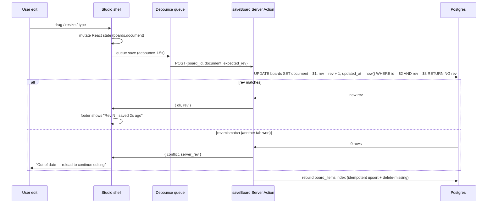

# Board persistence

How a moodboard's canvas state is stored, saved, versioned, and exported. The headline decision: the canvas is a **single JSONB document** (`boards.document`), not a set of normalised rows. This page covers why, the schema, the autosave loop, revisions, and the import/export format.

See [README.md](README.md) for the broader moodboard architecture.

---

## Source of truth

```
┌─────────────────────────────────────────────┐
│  boards.document  (JSONB)                    │
│  ──────────────────────────                  │
│  Source of truth for the canvas              │
│  - item positions, sizes, rotations, z-order │
│  - sticky note text, headings                │
│  - layout mode, palette, brief               │
│  - external refs (project_item_id, etc.)     │
└────────────────┬────────────────────────────┘
                 │  on save: rebuild the index
                 ▼
┌─────────────────────────────────────────────┐
│  board_items  (relational rows)              │
│  ──────────────────────────                  │
│  Derived index — never written to directly   │
│  - lets us answer "where is X used?"         │
│  - 1 row per item in the document            │
│  - PRIMARY KEY (board_id, item_id)           │
└─────────────────────────────────────────────┘
```

The flat table is a **derived index**, not the truth. We rebuild it idempotently on every save inside the same transaction. This gives us SQL-queryable reverse lookups ("which boards reference `project_items.id = …`?") without giving up the document model.

### Why a document, not flat rows

| Concern | Document wins because… |
|---|---|
| Canva-style import/export | A board exports as a single JSON file; one round-trip on import |
| Atomic saves | No partial-write races between sibling rows mid-edit |
| Cheap revisions | A row copy snapshots the whole canvas |
| AI iteration | Future "auto-arrange" / "suggest palette" reads and writes the same tree |
| Future collab (Yjs) | Document → CRDT swap doesn't churn the schema; Realtime channel stays the same |
| Schema evolution | Adding an item kind = code change, no migration |

The cost: you can't `UPDATE boards SET document = jsonb_set(...) WHERE …` from many concurrent editors and expect sane merging. We solve that in v1 by **single-editor + last-writer-wins**, with the rev counter as a stale-tab tripwire (below). Multiplayer is a v2 problem we explicitly leave room for.

---

## Document schema (`v: 1`)

```ts
type BoardDocument = {
  v: 1
  size: { w: number; h: number }
  background: { kind: 'paper' | 'plain'; tone: 'warm' | 'neutral' | 'cool' | 'dark' }
  layout: 'freeform' | 'zones' | 'grid'
  items: BoardItem[]
}

type BoardItem =
  | ProductItem    // references project_items
  | MaterialItem   // references board_materials
  | AssetItem      // references board_assets (uploaded image)
  | SwatchItem     // inline color (no ref)
  | NoteItem       // sticky note
  | TextItem       // heading / caption

type Frame = { x: number; y: number; w: number; h: number; rot: number; z: number }

type ProductItem  = { id: string; kind: 'product';  ref: { project_item_id: string }; frame: Frame; label_visible?: boolean; shape?: 'rect' | 'circle' }
type MaterialItem = { id: string; kind: 'material'; ref: { material_id: string };     frame: Frame; shape?: 'rect' | 'circle' }
type AssetItem    = { id: string; kind: 'asset';    ref: { asset_id: string };        frame: Frame; crop?: { x: number; y: number; w: number; h: number } }
type SwatchItem   = { id: string; kind: 'swatch';   hex: string; label?: string;       frame: Frame; shape?: 'rect' | 'circle' }
type NoteItem     = { id: string; kind: 'note';     text: string;                      frame: Frame }
type TextItem     = { id: string; kind: 'text';     text: string; font?: 'serif' | 'sans'; size?: number; frame: Frame }
```

**Item ids** are document-scoped strings (e.g. `i-AB12CD`). They're stable for the life of the item and survive duplication, copy/paste, and import.

**Refs are external pointers**, not embedded copies. Renaming a product, replacing a swatch image, or updating a material's price flows through to every board that uses it without rewriting documents. The trade-off: deleting a referenced row leaves dangling refs — the renderer treats those as placeholder tiles ("Item no longer available") and a server-side janitor sweep nulls the corresponding `board_items.project_item_id` so the index stays clean.

---

## Autosave loop



- **Debounce: 1.5 s.** Tuned to feel responsive without thrashing the DB on every drag-frame.
- **Coalesced.** Mid-flight saves cancel pending ones — only the last serialized state goes through.
- **Optimistic.** UI updates immediately; the saver runs in the background. Failure surfaces as a non-blocking toast.
- **Rev-checked.** `WHERE rev = $expected` is the soft lock. A stale tab can't clobber a fresher save.

The Server Action runs the index rebuild in the same transaction:

```sql
-- inside saveBoard, after UPDATE boards
DELETE FROM board_items
  WHERE board_id = $1 AND item_id <> ALL($2::text[]);

INSERT INTO board_items (board_id, item_id, ref_kind, project_item_id, material_id, asset_id)
  SELECT $1, item_id, ref_kind, project_item_id, material_id, asset_id
  FROM jsonb_to_recordset($3) AS t(item_id text, ref_kind text, project_item_id uuid, material_id uuid, asset_id uuid)
  ON CONFLICT (board_id, item_id) DO UPDATE
    SET ref_kind = EXCLUDED.ref_kind,
        project_item_id = EXCLUDED.project_item_id,
        material_id = EXCLUDED.material_id,
        asset_id = EXCLUDED.asset_id;
```

The action serialises the index input client-side from the document tree before sending — the server doesn't re-parse JSONB to derive it.

---

## Revisions

```sql
CREATE TABLE public.board_revisions (
  id          uuid PRIMARY KEY DEFAULT gen_random_uuid(),
  board_id    uuid NOT NULL REFERENCES public.boards(id) ON DELETE CASCADE,
  rev         int  NOT NULL,
  document    jsonb NOT NULL,
  author_id   uuid REFERENCES public.profiles(id),
  reason      text,                                -- 'autosave' | 'snapshot' | 'restore'
  created_at  timestamptz NOT NULL DEFAULT now(),
  UNIQUE (board_id, rev)
);
CREATE INDEX board_revisions_board_idx ON public.board_revisions (board_id, created_at DESC);
```

Strategy:

- **Throttled snapshots.** Most autosaves don't insert a revision. A revision is written when (a) ≥ 5 minutes since the last revision *and* the document changed, or (b) the user explicitly snapshots ("Save version"), or (c) before any irreversible action (e.g. document import overwrite).
- **Retention.** Keep all snapshots for 30 days, then thin to one per day for 90 days, then one per week indefinitely. A nightly Inngest cron handles thinning.
- **Restore.** "Restore version" = `UPDATE boards SET document = revision.document, rev = rev + 1` and write a new revision row with `reason = 'restore'`. The original revision is preserved.

This is decoupled from autosave — revisions are an audit + recovery feature, not a live undo stack. In-session undo/redo is a separate client-side operation (the studio keeps a bounded ring buffer of recent documents in memory).

---

## Import / export — `.speclyy-board.json`

A board exports as a single JSON file:

```json
{
  "format": "speclyy-board",
  "format_version": 1,
  "exported_at": "2026-04-28T10:00:00Z",
  "exported_from": "https://moodboard.speclyy.com/board/8e1f…",
  "board": {
    "name": "Maison Verdant — Dining",
    "brief": "Warm, collected, sun-washed…",
    "palette": [{"hex": "#B4572C", "source": "manual"}, …],
    "document": { /* full BoardDocument tree */ }
  },
  "assets": [
    { "id": "a-…", "url": "https://…/board-uploads/…", "width": 2400, "height": 1600 }
  ],
  "external_refs": {
    "project_items": [{ "id": "8e1f…", "name": "Carrara console", "image_url": "…" }],
    "materials":     [{ "id": "3a90…", "name": "Tierras, Senape", "hex": "#D8C28A" }]
  }
}
```

**External refs are exported as denormalised snapshots**, so the file is portable across workspaces. On import:

- If a ref's `id` exists in the importing user's data → re-link.
- Otherwise → create a "frozen" copy in `board_materials` with the snapshot data and `meta.imported_from = 'export'`. The new id is rewritten into the document tree.
- Asset URLs are re-uploaded to the importing user's `board-uploads` bucket and rewritten.

This is what makes the moodboard "Canva-style" portable: a board is a self-contained file.

> **Note on Canva interop.** Canva has no public import API for its native format (`.canva`). The Canva export is therefore a **PDF + SVG download** that a designer uploads into Canva manually. Tracked in [export.md](export.md). The `.speclyy-board.json` file is for round-tripping between Speclyy boards (your work, your studio's work, future template marketplaces).

---

## Schema versioning

`document.v` is a forward-only integer. Migrations run in two places:

```ts
// packages/db/src/board-doc-migrations.ts
const migrations: Record<number, (doc: any) => any> = {
  // example: rename `frame.angle` to `frame.rot` between v1 and v2
  1: (doc) => doc, // identity
}

export function migrateBoardDoc(doc: any): BoardDocument {
  let v = doc.v ?? 1
  while (v < CURRENT_VERSION) {
    doc = migrations[v](doc)
    v++
  }
  return doc
}
```

- Run on the **client** when loading a stale document — keeps stale tabs working.
- Run on the **server** in the saveBoard Server Action — canonicalises before write.

A document is always saved at `CURRENT_VERSION`. We never mass-migrate the table; old documents migrate forward the next time they're opened and saved.

---

## Realtime hook (provisioned)

The autosaver subscribes to a Supabase Realtime channel keyed on the board:

```ts
const channel = supabase.channel(`board:${boardId}`)
  .on('postgres_changes', {
    event: 'UPDATE', schema: 'public', table: 'boards', filter: `id=eq.${boardId}`,
  }, ({ new: row }) => {
    if (row.rev > localRev) {
      // another tab / future collaborator saved — reload
    }
  })
  .subscribe()
```

For v1, this only handles the "second tab on the same board" case. Multiplayer (CRDT/Yjs over the same channel, with `document` becoming a Yjs binary doc) is the v2 path — the table shape doesn't change, the encoding does.

---

## RLS

```sql
ALTER TABLE public.boards          ENABLE ROW LEVEL SECURITY;
ALTER TABLE public.board_items     ENABLE ROW LEVEL SECURITY;
ALTER TABLE public.board_revisions ENABLE ROW LEVEL SECURITY;

-- Owner read/write
CREATE POLICY boards_owner ON public.boards FOR ALL
  USING (owner_id = auth.uid())
  WITH CHECK (owner_id = auth.uid());

-- Org members read/write (studio team)
CREATE POLICY boards_org ON public.boards FOR ALL
  USING (org_id IS NOT NULL AND org_id IN (
    SELECT organization_id FROM public.organization_members WHERE user_id = auth.uid()
  ));

-- board_items inherits via boards
CREATE POLICY board_items_via_board ON public.board_items FOR ALL
  USING (board_id IN (SELECT id FROM public.boards));
-- (the boards SELECT itself is filtered by the boards policies above)
```

Public share access is **not** granted via RLS — it's served by a dedicated unauthenticated Route Handler that resolves the share token and returns a redacted document (no `owner_id`, no comment author user ids). See [sharing.md](sharing.md).

---

## References

- [README.md](README.md) — moodboard overview
- [sharing.md](sharing.md) — share tokens, comments, anonymous access
- [export.md](export.md) — PNG/PDF render pipeline
- [../database.md](../database.md) — parent tables (`projects`, `project_groups`, `project_items`)
- [../storage.md](../storage.md) — `board-uploads` bucket pattern
