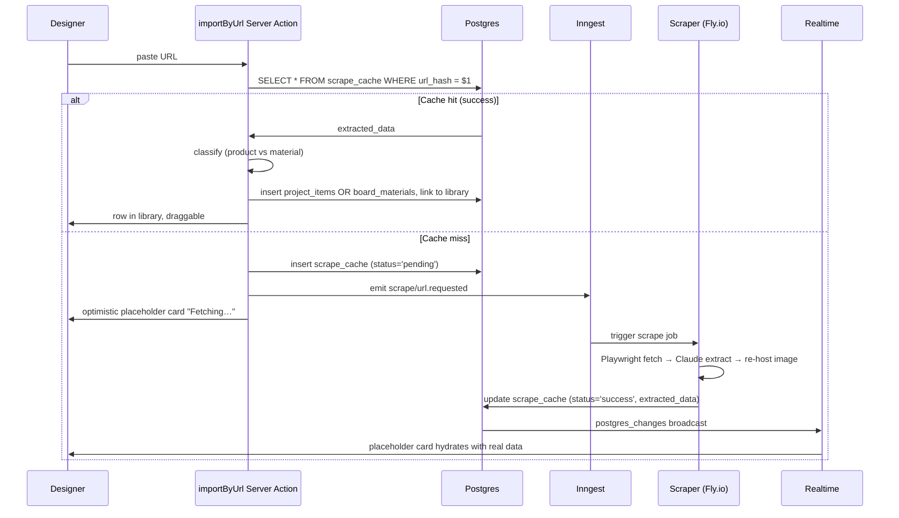

# Import

How items get into the library and onto the canvas. Four sources unioned at the data layer, three entry points in the UI, one shared scraper pipeline.

See [materials.md](materials.md) for the materials data model and [README.md](README.md) for the broader architecture.

---

## The four sources

```
                        ┌────────────────────────────────────────┐
                        │  Library rail (right pane)              │
                        ├────────────────────────────────────────┤
                        │                                         │
   global_products  ───►│  Curated catalogue                     │
   project_items    ───►│  My prior items                        │
   board_materials  ───►│  Studio-shared (org_id = current org)  │
   scrape_cache     ───►│  Paste-a-URL-now → scraper             │
                        │                                         │
                        └────────────────────────────────────────┘
```

Three are existing tables; the fourth is the existing on-demand scraper pipeline. **No new ingestion infrastructure** — the moodboard reuses what's already in production.

---

## Three entry points

| Entry | What | Behind the scenes |
|---|---|---|
| Library search + filter + drag | Browse + drop onto canvas | Single union query, client-side filter, HTML5 DnD across panel boundary |
| "Import" button → modal | Bulk-add from a supplier or paste a URL | Multi-select; for URL paste, calls the existing scraper |
| Drag from URL bar / desktop image | Quick add | URL → scraper; image → `board_assets` upload |

The third entry is a v2 nicety — it's listed here so it's not designed-around. v1 ships with the first two.

---

## URL paste path (reuses existing scraper)



This is *exactly* the existing on-demand scraper flow ([../scraper/on-demand.md](../scraper/on-demand.md)). The moodboard adds one new step at the end: the **product-vs-material classifier**.

### Product vs material classifier

When the scraper returns extracted data, we decide where it lands:

```ts
function classifyScraped(extracted: ExtractedData): 'product' | 'material' {
  // Strong signals for product
  if (extracted.sku && extracted.dimensions) return 'product'
  if (extracted.brand && extracted.collection && extracted.dimensions) return 'product'

  // Strong signals for material
  if (extracted.kind === 'paint' || extracted.hex) return 'material'
  if (extracted.kind === 'fabric' && !extracted.dimensions) return 'material'
  if (extracted.kind === 'tile' && !extracted.dimensions) return 'material'

  // Default: material (safer — moves to project_items only on explicit promotion)
  return 'material'
}
```

**Default = material** because demoting `project_items → board_materials` is awkward (project_items may already be referenced from the spec sheet). Promoting is one click ("Add to project items"). The bias keeps the spec sheet clean.

### URL normalisation + deduping

`scrape_cache` keys on `url_hash = sha256(normalisedUrl)`. The same product URL pasted by ten designers triggers one scrape. The flywheel that already benefits the spec-sheet flow benefits the moodboard for free.

---

## Bulk supplier import (POC modal)

The POC's import modal models a "connected supplier" flow — pick a supplier, browse their catalogue, multi-select and import. In production this becomes:

| Supplier kind | Implementation |
|---|---|
| Has a public catalogue API | Adapter calls the API directly, normalises into `LibraryEntry`, designer multi-selects, Server Action upserts into `board_materials` |
| No API but has a sitemap | Reuses the existing **bulk crawl** pipeline ([../scraper/bulk-crawl.md](../scraper/bulk-crawl.md)) — admin queues a brand crawl, designers see results once cached |
| No useful structure | Designer pastes individual URLs as needed |

For v1 we ship the URL paste path and a small set of curated seeded materials. Supplier API adapters are added per-supplier as we close real business deals — they don't need framework-level infrastructure, just a small adapter file:

```ts
// packages/db/src/supplier-adapters/farrow-and-ball.ts
export const farrowAndBall: SupplierAdapter = {
  id: 'farrow-and-ball',
  name: 'Farrow & Ball',
  async list(query?: string): Promise<LibraryEntry[]> {
    const items = await fetchFB(query)
    return items.map(normalise)
  },
}
```

Adapters live in `@speclyy/db` (or a future `@speclyy/suppliers` package) so both the moodboard and the main app can reuse them.

---

## Asset upload (designer photos)

For images that aren't products or materials — Pinterest rips, hand sketches, fabric photos taken on a phone — designers upload directly:

```ts
'use server'
export async function uploadBoardAsset(boardId: string, file: File) {
  await assertBoardWritable(boardId)
  const path = `${ownerId}/${boardId}/${nanoid()}.${ext(file.type)}`
  await supabase.storage.from('board-uploads').upload(path, file, { upsert: false })
  const dim = await probeImage(file)
  const [asset] = await db.insert(boardAssets).values({
    ownerId, storagePath: path, mimeType: file.type, byteSize: file.size,
    width: dim.w, height: dim.h,
  }).returning()
  return asset
}
```

Constraints:

- Max 20 MB per asset.
- Allowed: `image/png`, `image/jpeg`, `image/webp`, `image/svg+xml`.
- Quota: 1 GB per designer (soft limit, surfaced in account UI). Enforced at upload time via a sum query over `board_assets.byte_size`.
- The `board-uploads` bucket is **public-read** (matches `product-images`); access control is by URL secrecy, same as scraped product images. Truly private moodboards are a later concern that ladders into signed URLs.

Drag-and-drop from desktop is a thin wrapper over the same Server Action. Paste-image-from-clipboard is a v2 polish.

---

## Concurrency & idempotency

| Risk | Mitigation |
|---|---|
| Two designers paste the same URL simultaneously | `scrape_cache` has `UNIQUE(url_hash)`; second insert collides, second client polls instead of triggering a duplicate job |
| Scraper retries clobber a stale cache row | Scraper updates use `WHERE url_hash = $1 AND attempts < N` — bounded retries, no infinite churn |
| Designer adds a material, deletes it, re-adds | `board_materials.id` is regenerated; the old `board_items` rows are cleaned up by the saveBoard index rebuild ([board-persistence.md](board-persistence.md)) |
| Asset upload fails partway | Storage upload + DB row creation in the same Server Action; storage failure aborts the row, row failure deletes the storage object |

---

## Cross-references with the main app

The library cross-pollinates with the existing spec-sheet workflow:

- A material added to the moodboard from the URL paste path **does not** appear in the project's spec sheet by default — it only appears when the designer explicitly drags it from the library to the canvas *and* it's classified as a `product`, *or* when they manually promote a `board_material` to a `project_item`.
- A `project_item` added in the main app *does* appear in the moodboard library under "My prior items" automatically (no copy step). Editing the spec in the main app updates the item label on the moodboard.
- Deleting a `project_item` while it's referenced from a board leaves a dangling ref. The renderer shows a placeholder; a janitor sweep ([board-persistence.md](board-persistence.md)) nulls the index reference.

This bidirectional relationship is the reason `boards.document` references items by id rather than embedding their data — the spec sheet and the moodboard read the *same* row.

---

## Open items

- Bulk paste (multiple URLs at once) — scraper handles individually, UI just iterates.
- Smart deduping in library ("you already have a similar Tierras tile") — v2.
- Supplier OAuth (designer connects their own trade account, sees pricing) — large effort, deferred.
- "Add all from this Pinterest board" via Pinterest API — out of scope until v2.

---

## References

- [README.md](README.md) — moodboard overview
- [materials.md](materials.md) — `board_materials` model + library union shape
- [board-persistence.md](board-persistence.md) — how imported items become canvas items
- [../scraper/README.md](../scraper/README.md) — scraper overview
- [../scraper/on-demand.md](../scraper/on-demand.md) — exact URL paste pipeline reused here
- [../scraper/bulk-crawl.md](../scraper/bulk-crawl.md) — for sitemap-based supplier ingestion
- [../storage.md](../storage.md) — `board-uploads` and `product-images` bucket patterns
