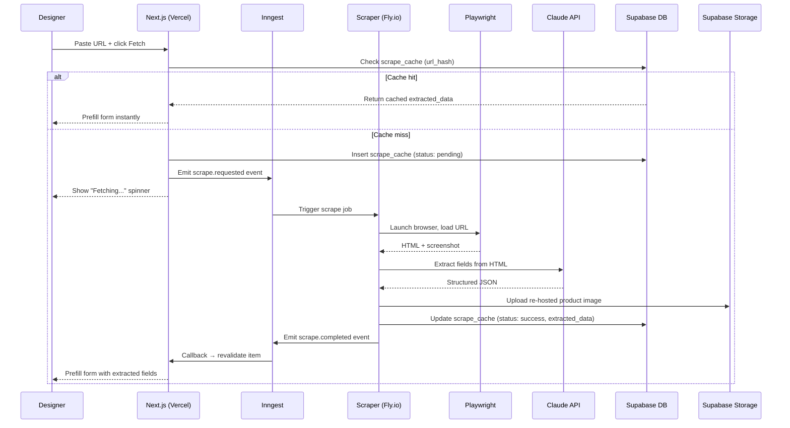

# AI Scraper — Architecture

How the URL-to-product extraction pipeline works. This is Speclyy's core differentiator — "paste a URL, get prefilled fields."

> **ADR status:** ADR-0010 (scraper host), ADR-0011 (job queue), ADR-0012 (extraction strategy) are pending — this document captures the proposed architecture ahead of those decisions being locked.

---

## Overview



---

## Why this must be a separate service

Three constraints force the scraper off Vercel:

1. **Vercel has a 300s max function timeout.** Playwright sessions can take 5–60s. More importantly, anti-bot retries with exponential backoff can exceed 5 minutes.
2. **Vercel can't run Playwright.** No persistent binary, no headless Chrome, no filesystem for browser cache. It simply doesn't work.
3. **Scraping is I/O bound and bursty.** Multiple designers may paste URLs simultaneously. The scraper needs its own resource pool, not Vercel's function concurrency.

**Solution:** Long-running Node.js container on Fly.io, triggered asynchronously via Inngest.

---

## Components

### 1. Scrape cache (`scrape_cache` table)

First thing checked before enqueuing a job. Two designers pasting the same Delta Faucet URL should trigger one scrape.

```ts
// Server Action — check cache before enqueuing
const hash = sha256(normaliseUrl(url))

const [cached] = await db
  .select()
  .from(scrapeCache)
  .where(eq(scrapeCache.urlHash, hash))
  .limit(1)

if (cached?.status === 'success' && !isExpired(cached.expiresAt)) {
  return { source: 'cache', data: cached.extractedData }
}
```

URL normalisation strips tracking params (`?utm_source=...`), trailing slashes, and fragments so `delta.com/product/T14?ref=ad` and `delta.com/product/T14` hit the same cache entry.

---

### 2. Job queue — Inngest

Inngest sits between Next.js and the scraper. It manages retries, step isolation, and delivery guarantees.

```ts
// Next.js Server Action — enqueue the job
import { inngest } from '@/lib/inngest'

await inngest.send({
  name: 'scrape/url.requested',
  data: { url, urlHash: hash, userId, itemId },
})
```

```ts
// Scraper service — Inngest function
export const scrapeUrl = inngest.createFunction(
  {
    id: 'scrape-url',
    retries: 3,
    concurrency: { limit: 5 },  // max 5 simultaneous Playwright sessions
  },
  { event: 'scrape/url.requested' },
  async ({ event, step }) => {
    const { url, urlHash, userId, itemId } = event.data

    // Step 1: Playwright scrape (retried independently)
    const { html, screenshotBase64 } = await step.run('playwright-scrape', async () => {
      return await runPlaywright(url)
    })

    // Step 2: Claude extraction (retried independently — Playwright doesn't re-run)
    const extracted = await step.run('claude-extract', async () => {
      return await extractWithClaude(html, screenshotBase64)
    })

    // Step 3: Re-host image
    const imageUrl = await step.run('rehost-image', async () => {
      return await rehostImage(extracted.imageUrl, userId, itemId)
    })

    // Step 4: Persist
    await step.run('persist', async () => {
      await db.update(scrapeCache).set({
        status: 'success',
        extractedData: { ...extracted, imageUrl },
        scrapeDurationMs: Date.now() - event.ts,
      }).where(eq(scrapeCache.urlHash, urlHash))
    })

    return { success: true, itemId }
  }
)
```

Step isolation means if Claude extraction fails, Playwright doesn't re-run — only the extraction step is retried. This is important because Playwright sessions are expensive and risk triggering anti-bot systems on repeated hits.

---

### 3. Playwright (stealth)

```ts
import { chromium } from 'playwright-extra'
import StealthPlugin from 'puppeteer-extra-plugin-stealth'

chromium.use(StealthPlugin())

export async function runPlaywright(url: string) {
  const browser = await chromium.launch({
    args: ['--no-sandbox', '--disable-setuid-sandbox', '--disable-dev-shm-usage'],
  })

  const context = await browser.newContext({
    userAgent: 'Mozilla/5.0 (Macintosh; Intel Mac OS X 10_15_7) ...',
    viewport: { width: 1280, height: 800 },
    locale: 'en-US',
  })

  const page = await context.newPage()

  try {
    await page.goto(url, { waitUntil: 'networkidle', timeout: 30_000 })
    await page.waitForTimeout(2000)  // allow lazy content to render

    const html = await page.content()
    const screenshot = await page.screenshot({ type: 'webp', fullPage: false })

    return { html, screenshotBase64: screenshot.toString('base64') }
  } finally {
    await browser.close()
  }
}
```

**Stealth plugin** patches:
- `navigator.webdriver` flag (primary detection vector)
- Chrome runtime properties
- Canvas fingerprint
- WebGL fingerprint
- Plugin enumeration

**Anti-bot escalation strategy:**

| Attempt | Strategy |
|---|---|
| 1 | Standard Playwright + stealth |
| 2 (retry) | Random delay 3–8s before request |
| 3 (retry) | Residential proxy rotation (future — add when blocked domains accumulate) |
| Give up | Return `status: 'failed'`, fallback to manual entry |

---

### 4. Claude extraction

After Playwright returns HTML, Claude extracts structured product fields.

```ts
export async function extractWithClaude(
  html: string,
  screenshotBase64: string
): Promise<ExtractedProduct> {
  const truncatedHtml = truncateHtml(html, 15_000)  // trim to ~15k chars of meaningful content

  const response = await anthropic.messages.create({
    model: 'claude-opus-4-5',
    max_tokens: 1024,
    messages: [
      {
        role: 'user',
        content: [
          {
            type: 'text',
            text: `You are extracting product data from an interior design product page.

Return a JSON object matching this schema exactly:
{
  "product_name": string | null,
  "brand": string | null,
  "collection": string | null,
  "finishes": string[] | null,   // e.g. ["Stainless", "Matte Black"]
  "sku": string | null,
  "dimensions": object | null,   // e.g. { "rough_in": "1/2 inch IPS" }
  "image_url": string | null     // absolute URL of the main product image
}

Rules:
- Return null for any field you cannot find with confidence.
- Do not invent or guess data. Accuracy matters more than completeness.
- For finishes, return all available finish/colour options you can find.
- For SKU, prefer the model number, not a UPC.

Page HTML:
${truncatedHtml}`,
          },
          {
            type: 'image',
            source: {
              type: 'base64',
              media_type: 'image/webp',
              data: screenshotBase64,
            },
          },
        ],
      },
    ],
  })

  return JSON.parse(response.content[0].text)
}
```

**Why include the screenshot:** Some product pages render finish swatches as images with no text labels. Claude can read swatches visually and extract finish names the HTML doesn't contain.

**HTML truncation strategy:** Strip `<script>`, `<style>`, `<svg>` tags and hidden elements before passing to Claude. Prioritise the main content area (`main`, `[data-product]`, `.product-details`). 15k characters captures most product pages without hitting context limits.

---

### 5. Fallback states

Three outcomes, each with a defined UX. No outcome crashes the flow.

| Outcome | Condition | What's saved | UX |
|---|---|---|---|
| **Full success** | All key fields extracted | `scrape_cache.status = 'success'`, full `extracted_data` | Form prefilled, designer reviews and corrects |
| **Partial success** | Some fields found | `status = 'success'`, partial `extracted_data` | Form partially filled, missing fields shown as TBD |
| **Full failure** | Timeout, anti-bot block, invalid URL | `status = 'failed'`, `error_message` set | Blank form with URL pre-saved, "Couldn't fetch — fill in manually" message |

The URL is **always saved** to the item record. Even on full failure, the designer has a clickable link to the original page.

---

### 6. Global inventory governance hook

After a successful scrape of a whitelisted domain (delta.com, kohler.com, brizo.com, etc.), the scraper runs the promotion check:

```ts
async function checkGlobalPromotion(extracted: ExtractedProduct, url: string) {
  const domain = new URL(url).hostname.replace('www.', '')

  if (!WHITELISTED_DOMAINS.includes(domain)) return

  // Check for duplicate in global_products
  const [existing] = await db
    .select()
    .from(globalProducts)
    .where(and(
      eq(globalProducts.brand, extracted.brand ?? ''),
      eq(globalProducts.sku, extracted.sku ?? ''),
    ))
    .limit(1)

  if (existing) return  // already in global library

  // Insert into promotion queue for internal review
  await db.insert(promotionQueue).values({
    scrapeUrl: url,
    extractedData: extracted,
    status: 'pending_review',
  })
}
```

Internal review → approve → insert into `global_products`. This is the mechanism that grows the global library without manual data entry at scale.

---

## Scraper service on Fly.io

```dockerfile
# Dockerfile (scraper service)
FROM mcr.microsoft.com/playwright:v1.44.0-jammy

WORKDIR /app
COPY package*.json ./
RUN npm ci --only=production

COPY . .

# Playwright browsers installed by base image
CMD ["node", "dist/server.js"]
```

```toml
# fly.toml
app = "speclyy-scraper"
primary_region = "iad"  # same region as Supabase (us-east-1)

[build]

[http_service]
  internal_port = 3001
  auto_stop_machines = false  # keep warm — cold start adds 2-3s
  min_machines_running = 1

[[vm]]
  cpu_kind = "shared"
  cpus = 1
  memory_mb = 512  # Playwright needs ~400MB per session
```

One always-on instance handles up to 5 concurrent scrape jobs (Inngest concurrency limit). Scale horizontally with `fly scale count 2` if queue backs up.

---

## Key decisions pending (ADRs)

| Decision | Options | Leaning |
|---|---|---|
| **Scraper host** | Fly.io vs Railway vs Render | Fly.io — persistent container, same-region as Supabase |
| **Job queue** | Inngest vs SQS + Lambda vs BullMQ + Redis | Inngest — step isolation, no Redis, Vercel-native |
| **Extraction model** | Claude Opus vs Sonnet | Opus for quality; revisit Sonnet if cost becomes material |
| **HTML truncation** | Full HTML vs DOM-pruned vs visible-text | DOM-pruned (strip scripts/styles, keep content) |
| **Scrape cache TTL** | Never expire vs 30-day vs 90-day | Never expire for stable product pages; 30 days for pages with pricing |
| **Image re-hosting** | Always vs only on failure | Always — vendor URLs break over time |

---

## References

- [ADR-0010 — Scraper host: Fly.io](adr/0010-scraper-host.md) *(pending)*
- [ADR-0011 — Job queue: Inngest](adr/0011-job-queue.md) *(pending)*
- [ADR-0012 — Extraction strategy: Claude API](adr/0012-extraction-strategy.md) *(pending)*
- [database.md](database.md) — `scrape_cache` table schema
- [storage.md](storage.md) — image re-hosting to Supabase Storage
- [MVP decisions](../mvp-decisions.md) — URL paste behaviour decision
