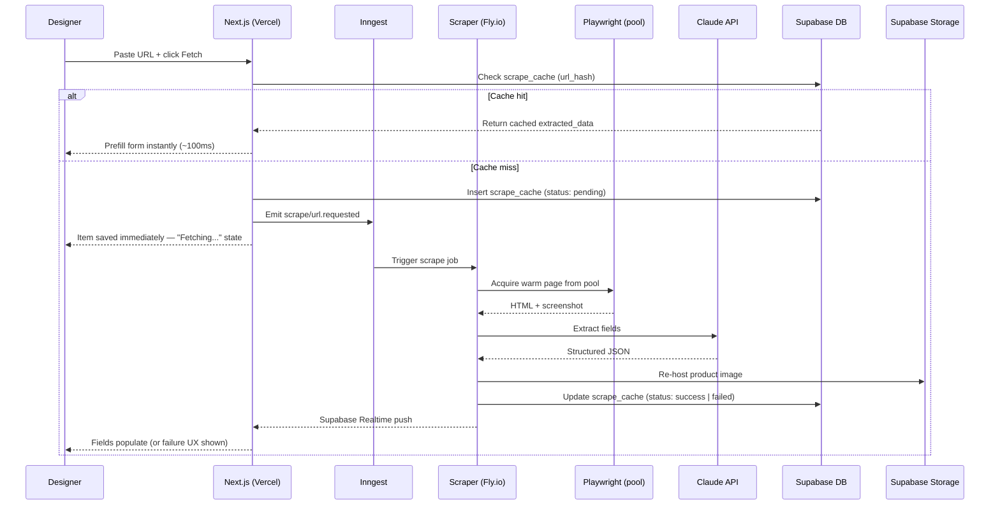

# AI Scraper — Architecture

Speclyy's core differentiator: paste a product URL, get prefilled specification fields in seconds. This folder covers every layer of the pipeline.

> ADRs 0010–0014 are locked. See [../adr/](../adr/) for host, queue, extraction model, bulk crawl, and log store decisions.

---

## High-level flow

---

## Why this must be a separate service

Three constraints force the scraper off Vercel:

| Constraint | Detail |
|---|---|
| **300s max function timeout** | Playwright + anti-bot retries with exponential backoff can exceed 5 minutes |
| **No Playwright on Vercel** | No persistent binary, no headless Chrome, no filesystem for browser cache |
| **Bursty I/O workload** | Multiple simultaneous scrapes need a dedicated resource pool, not shared function concurrency |

**Solution:** Persistent Node.js container on Fly.io (`auto_stop_machines = false`), triggered asynchronously via Inngest.

---

## Sub-documents

| Document | What it covers |
|---|---|
| [on-demand.md](on-demand.md) | Cache check, Inngest step isolation, Playwright stealth, Claude extraction, async UX, failure UX |
| [bulk-crawl.md](bulk-crawl.md) | Admin-triggered brand crawls, URL discovery, daily batching, admin API |
| [performance.md](performance.md) | Browser pool, pre-warm strategies, speculative scraping, cache flywheel |
| [failure-tracking.md](failure-tracking.md) | Failure taxonomy, schema, admin API, Axiom queries, feedback loop |
| [compliance.md](compliance.md) | User-Agent, robots.txt handling, ToS denylist, takedown SLA, ownership |

---

## Locked decisions

| Decision | Choice | ADR |
|---|---|---|
| Scraper host | Fly.io | [ADR-0010](../adr/0010-scraper-host.md) |
| Job queue | Inngest | [ADR-0011](../adr/0011-job-queue.md) |
| Extraction model | Claude Opus (`claude-opus-4-7`) | [ADR-0012](../adr/0012-extraction-strategy.md) |
| HTML truncation | DOM-pruned ~15k chars + screenshot | [ADR-0012](../adr/0012-extraction-strategy.md) |
| Scrape cache TTL | Default 90 days; extend to 1 year for known-stable domains via `domains.ts` | [ADR-0012](../adr/0012-extraction-strategy.md) |
| Image re-hosting | Always re-host to Supabase Storage | [ADR-0009](../adr/0009-storage.md) |
| Bulk crawl design | Inngest cron + fan-out + domain throttle | [ADR-0013](../adr/0013-bulk-crawl.md) |
| Log store | Axiom | [ADR-0014](../adr/0014-log-store.md) |

---

## References

- [../database.md](../database.md) — `scrape_cache`, `crawl_jobs`, `crawl_urls` schemas
- [../storage.md](../storage.md) — image re-hosting bucket
- [../adr/0010-scraper-host.md](../adr/0010-scraper-host.md)
- [../adr/0011-job-queue.md](../adr/0011-job-queue.md)
- [../adr/0012-extraction-strategy.md](../adr/0012-extraction-strategy.md)
- [../adr/0013-bulk-crawl.md](../adr/0013-bulk-crawl.md)
- [../adr/0014-log-store.md](../adr/0014-log-store.md)
