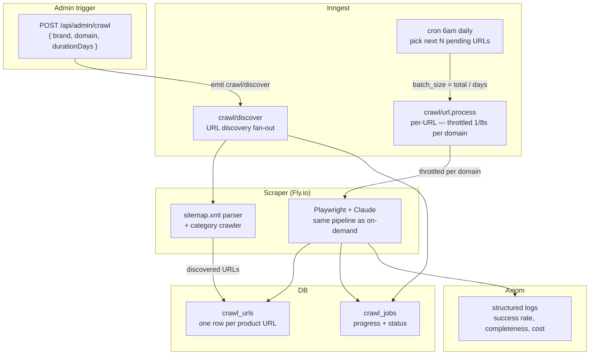

# Bulk Crawl

Admin-triggered pipeline for building the global product library by scraping entire brand catalogs. See [ADR-0013](../adr/0013-bulk-crawl.md) for the full design rationale.

---

## Overview



---

## Step 1 — Admin trigger

```bash
curl -X POST https://app.speclyy.com/api/admin/crawl \
  -H "Authorization: Bearer $ADMIN_API_KEY" \
  -H "Content-Type: application/json" \
  -d '{
    "brand": "Delta",
    "domain": "deltafaucet.com",
    "durationDays": 10,
    "rateLimitMs": 8000
  }'
```

This inserts a `crawl_jobs` row (`status: discovering`) and emits a `crawl/discover` Inngest event.

### Admin endpoint hardening

All `/api/admin/*` routes are gated by the same three-layer middleware so a leaked bearer can't be turned into a cost bomb:

1. **Shared-secret bearer.** `ADMIN_API_KEY` is a 32-byte random string stored in Vercel's secret store (not checked in, not in `.env.example`). Rotated quarterly or immediately on suspected leak.
2. **Per-IP rate limit.** 10 requests per minute via Vercel KV + a token-bucket middleware. Starting a crawl, checking status, and pausing/resuming together fit comfortably inside the limit for a legitimate operator.
3. **Crawl cost ceiling.** `POST /api/admin/crawl` validates that `totalEstimatedUrls × $0.038` (Opus) stays below a `CRAWL_BUDGET_USD` envvar (default $100). Larger crawls return `402 Payment Required` and must be approved by setting a higher budget for the specific request.

If `ADMIN_API_KEY` does leak, the per-IP limit and budget ceiling together cap the blast radius at ~$100 before someone notices in Axiom.

---

## Step 2 — URL discovery

Both strategies run **in parallel** — sitemap coverage varies wildly between vendors (Delta ≈ 95%, boutique brands often <50%), so we never depend on a single source.

**sitemap.xml parsing**
```
GET https://{domain}/sitemap.xml   (then any nested sitemap indexes)
→ filter URLs matching product path patterns (/product/, /bathroom/, /kitchen/, etc.)
```

**Category page crawl (always, not fallback)**
```
Playwright renders collection/category pages
→ extracts all product links from rendered DOM
→ catches JS-rendered catalogs, new products not yet sitemapped, and fully sitemap-less vendors
```

Both streams dedupe into the same `crawl_urls` table. URLs already in `scrape_cache` with a valid success result (and `expires_at > now()`) are marked `skipped` — no re-scrape needed.

**robots.txt compliance.** Before inserting any URL into `crawl_urls`, the discovery step fetches `https://{domain}/robots.txt` and drops paths disallowed for our `User-Agent: Speclyy/1.0 (+https://speclyy.com/scraper)`. Domains with `respectRobots: false` in `domains.ts` bypass this check — that flag is only set when we have explicit written permission from the vendor.

**ToS denylist.** The admin API refuses to start a crawl against any domain in `BLOCKED_DOMAINS` ([compliance.md](compliance.md)) — the request returns `403 Forbidden` with the block reason. Discovery never enqueues URLs for a blocked domain even if somehow scheduled, and emits a `crawl_rejected_tos` event to Axiom so the admin can see the skip.

```ts
// De-duplicate against existing cache — skip only if unexpired success
const [alreadyScraped] = await db
  .select({ id: scrapeCache.id })
  .from(scrapeCache)
  .where(and(
    eq(scrapeCache.urlHash, urlHash),
    eq(scrapeCache.status, 'success'),
    gt(scrapeCache.expiresAt, new Date()),
  ))
  .limit(1)

const urlStatus = alreadyScraped ? 'skipped' : 'pending'
```

After discovery, `crawl_jobs.total_urls` is updated and `status` moves to `crawling`.

---

## Step 3 — Daily batch processing

```ts
// Inngest function — fires daily at 6am
export const bulkCrawlCron = inngest.createFunction(
  { id: 'bulk-crawl-daily-batch' },
  { cron: '0 6 * * *' },
  async ({ step }) => {
    const activeCrawls = await step.run('get-active-crawls', async () => {
      return await db
        .select()
        .from(crawlJobs)
        .where(eq(crawlJobs.status, 'crawling'))
    })

    for (const crawl of activeCrawls) {
      await step.run(`batch-${crawl.id}`, async () => {
        const batchSize = Math.ceil(crawl.totalUrls / crawl.durationDays)

        const pending = await db
          .select()
          .from(crawlUrls)
          .where(and(
            eq(crawlUrls.crawlJobId, crawl.id),
            eq(crawlUrls.status, 'pending'),
          ))
          .limit(batchSize)

        // Fan out — one event per URL
        await inngest.send(pending.map(u => ({
          name: 'crawl/url.process',
          data: {
            crawlJobId: crawl.id,
            crawlUrlId: u.id,
            url: u.url,
            urlHash: u.urlHash,
            domain: crawl.domain,
            brand: crawl.brand,
          },
        })))
      })
    }
  }
)
```

**Delta example:** 1,200 URLs / 10 days = 120 URLs/day = ~16 minutes of actual scraping at 8s rate limit. The domain sees traffic equivalent to one person browsing casually.

---

## Rate limiting

Inngest domain throttle — max 1 request per domain per 8 seconds, enforced across all concurrent workers:

```ts
export const processCrawlUrl = inngest.createFunction(
  {
    id: 'process-crawl-url',
    retries: 2,
    throttle: {
      key: 'event.data.domain',   // per-domain, not global
      count: 1,
      period: '8s',
    },
  },
  { event: 'crawl/url.process' },
  async ({ event, step }) => {
    // Same pipeline as on-demand scraping
    const { html, screenshotBase64 } = await step.run('playwright-scrape', () =>
      playwrightPool.runScrape(event.data.url)
    )
    const extracted = await step.run('claude-extract', () =>
      extractWithClaude(html, screenshotBase64)
    )
    await step.run('persist-and-update', async () => {
      // Update scrape_cache
      // Update crawl_urls.status
      // Increment crawl_jobs counters
      // Check global promotion
      // Log to Axiom
    })
  }
)
```

**Rate math:**
- 8s between requests = 7.5 requests/minute = 450/hour
- Delta 1,200 products / 10 days = 120/day
- At 450/hr, 120 URLs takes 16 minutes of actual scraping/day

---

## Progress + control

```bash
# Check status of all active crawls
curl https://app.speclyy.com/api/admin/crawl/status \
  -H "Authorization: Bearer $ADMIN_API_KEY"

# Response
{
  "activeCrawls": [{
    "id": "uuid",
    "brand": "Delta",
    "status": "crawling",
    "progress": "342/1204",
    "successRate": "94.7%",
    "failureRate": "5.3%",
    "eta": "2026-04-28",
    "topFailureDomains": []
  }]
}

# Pause mid-crawl (e.g. vendor complained about traffic)
curl -X POST https://app.speclyy.com/api/admin/crawl/{id}/pause \
  -H "Authorization: Bearer $ADMIN_API_KEY"

# Resume
curl -X POST https://app.speclyy.com/api/admin/crawl/{id}/resume \
  -H "Authorization: Bearer $ADMIN_API_KEY"
```

**Resumability:** `crawl_urls` rows persist. If the scraper restarts (Fly.io machine restart, deploy), the next cron tick picks up all `status = 'pending'` rows exactly where it left off.

---

## Observability — Axiom

Every URL processed emits a structured log event. The Axiom dashboard is the admin screen at MVP.

```kusto
// Success rate by domain — this week
['speclyy-scraper']
| where _time > ago(7d) and mode == "bulk_crawl"
| summarize
    total     = count(),
    succeeded = countif(status == "success"),
    failed    = countif(status == "failed"),
    rate      = round(100.0 * countif(status == "success") / count(), 1)
  by domain
| order by total desc

// Field completeness trend — Delta crawl
['speclyy-scraper']
| where brand == "Delta" and mode == "bulk_crawl"
| summarize avg_completeness = avg(completeness_pct) by bin(_time, 1d)

// Claude cost tracker
['speclyy-scraper']
| where _time > ago(30d)
| summarize
    input_tokens  = sum(claude_input_tokens),
    output_tokens = sum(claude_output_tokens),
    est_cost_usd  = sum(claude_input_tokens) * 0.000015
                  + sum(claude_output_tokens) * 0.000075
  by bin(_time, 1d)
```

For failure analysis and domain-level debugging, see [failure-tracking.md](failure-tracking.md).

---

## Fly.io config

```toml
# fly.toml
app = "speclyy-scraper"
primary_region = "iad"  # same region as Supabase (us-east-1)

[http_service]
  internal_port = 3001
  auto_stop_machines = false  # keep warm — cold start adds 2-3s for pool re-init
  min_machines_running = 1

[[vm]]
  cpu_kind = "shared"
  cpus     = 1
  memory_mb = 1024  # Playwright pool of 4 pages needs ~800MB
```

Scale during an active crawl if queue backs up:
```bash
fly scale count 2 --app speclyy-scraper  # second machine, second pool
```

---

## References

- [ADR-0013 — Bulk crawl design](../adr/0013-bulk-crawl.md)
- [ADR-0010 — Scraper host: Fly.io](../adr/0010-scraper-host.md)
- [ADR-0011 — Job queue: Inngest](../adr/0011-job-queue.md)
- [failure-tracking.md](failure-tracking.md) — failed URL analysis and retry
- [../database.md](../database.md) — `crawl_jobs` + `crawl_urls` schemas
