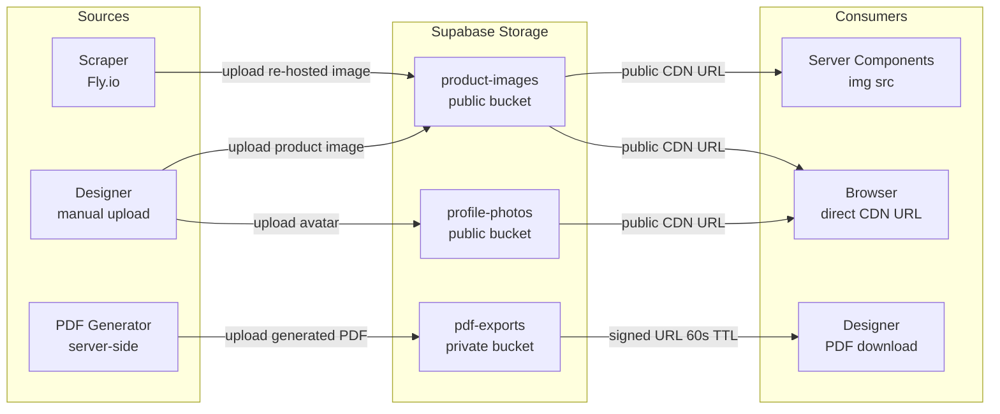

# Storage — Architecture

How Speclyy stores and serves binary assets. For the *why* behind the storage host decision, see [ADR-0009](adr/0009-storage.md).

---

## Overview



---

## Bucket structure

| Bucket | Visibility | Contents | RLS |
|---|---|---|---|
| `product-images` | Public | Product photos, scraped or uploaded | Owner write, authenticated read |
| `pdf-exports` | Private | Generated spec sheet PDFs | Owner read+write only, signed URLs |
| `profile-photos` | Public | Designer avatar photos (post-MVP) | Owner write, public read |

Public buckets serve assets directly via CDN URL — no signed URL needed. Private buckets require a short-lived signed URL generated server-side.

---

## Bucket policies

```sql
-- product-images: anyone authenticated can read, only owner can write
CREATE POLICY "product-images: authenticated read"
ON storage.objects FOR SELECT
TO authenticated
USING (bucket_id = 'product-images');

CREATE POLICY "product-images: owner write"
ON storage.objects FOR INSERT
TO authenticated
WITH CHECK (
  bucket_id = 'product-images'
  AND (storage.foldername(name))[1] = auth.uid()::text
);

-- pdf-exports: owner only
CREATE POLICY "pdf-exports: owner read"
ON storage.objects FOR SELECT
TO authenticated
USING (
  bucket_id = 'pdf-exports'
  AND (storage.foldername(name))[1] = auth.uid()::text
);

CREATE POLICY "pdf-exports: owner write"
ON storage.objects FOR INSERT
TO authenticated
WITH CHECK (
  bucket_id = 'pdf-exports'
  AND (storage.foldername(name))[1] = auth.uid()::text
);
```

Files are stored under `{userId}/...` paths so the folder prefix in the policy ties ownership to `auth.uid()`.

---

## File path conventions

```
product-images/
  {userId}/
    {itemId}.webp           ← product image for a specific item
    {itemId}-thumb.webp     ← generated by Supabase transform URL

pdf-exports/
  {userId}/
    {projectId}-{timestamp}.pdf

profile-photos/
  {userId}/
    avatar.webp
```

---

## Product image upload flow

### From scraper (URL paste)
1. Scraper Playwright session downloads the product image from the vendor site.
2. Scraper uploads it to `product-images/{userId}/{itemId}.webp` using the Supabase service-role key.
3. Scraper returns the Supabase Storage public URL as part of `extracted_data`.
4. Item row saved with `image_url` pointing to Supabase CDN.

Why re-host instead of using the vendor URL directly:
- Vendor URLs go dead (products get discontinued, CDN paths change)
- Vendor sites block hotlinking
- We control transforms and serving

### From designer (manual upload)
1. Client Component accepts file via `<input type="file">`.
2. Server Action receives the file, validates MIME type and size (<5MB).
3. Server Action uploads to `product-images/{userId}/{itemId}.webp` via Supabase client.
4. Returns public URL, saved to `project_items.image_url`.

```ts
// Server Action
"use server"
export async function uploadProductImage(itemId: string, formData: FormData) {
  const supabase = createSupabaseServerClient()
  const { data: { user } } = await supabase.auth.getUser()
  if (!user) throw new Error('Unauthorised')

  const file = formData.get('image') as File
  const path = `${user.id}/${itemId}.webp`

  const { error } = await supabase.storage
    .from('product-images')
    .upload(path, file, { contentType: 'image/webp', upsert: true })

  if (error) throw error

  const { data: { publicUrl } } = supabase.storage
    .from('product-images')
    .getPublicUrl(path)

  await db.update(projectItems)
    .set({ imageUrl: publicUrl })
    .where(eq(projectItems.id, itemId))
}
```

---

## Image transforms

Supabase Storage serves on-the-fly transforms via URL parameters — no Sharp pipeline required.

```ts
// Original
https://<project>.supabase.co/storage/v1/object/public/product-images/{path}

// Thumbnail (used in item rows)
${url}?width=120&height=120&resize=cover&quality=80

// Medium (used in item detail / PDF)
${url}?width=600&quality=85

// Helper
export function getProductImageUrl(path: string, variant: 'thumb' | 'medium' | 'original') {
  const base = `${process.env.NEXT_PUBLIC_SUPABASE_URL}/storage/v1/object/public/product-images/${path}`
  const params = {
    thumb:    '?width=120&height=120&resize=cover&quality=80',
    medium:   '?width=600&quality=85',
    original: '',
  }
  return base + params[variant]
}
```

---

## PDF export flow

1. Designer clicks **Download PDF** on the export preview screen.
2. Server Action runs the PDF generator (React-PDF, server-side).
3. Resulting PDF buffer uploaded to `pdf-exports/{userId}/{projectId}-{timestamp}.pdf`.
4. Server Action generates a **signed URL** with 60-second TTL.
5. Server Action returns the signed URL to the client.
6. Browser triggers download from the signed URL.
7. PDF expires from the bucket after 24 hours (lifecycle rule).

```ts
// Generate signed URL for PDF download
const { data: { signedUrl } } = await supabase.storage
  .from('pdf-exports')
  .createSignedUrl(`${userId}/${projectId}-${timestamp}.pdf`, 60)  // 60 seconds

return { downloadUrl: signedUrl }
```

Signed URLs are short-lived by design — PDFs are generated fresh per export request, not persisted as a permanent asset.

---

## Migration trigger and path

**Migrate to Cloudflare R2 when monthly overage exceeds $50/month** (~1,500–2,000 active designers).

See [ADR-0009](adr/0009-storage.md) for the full cost model.

### Migration steps

1. Create R2 bucket and configure public domain (e.g. `assets.speclyy.com` via Cloudflare).
2. Copy all objects: `rclone copy supabase:product-images r2:product-images`.
3. Update storage client to AWS S3 SDK pointing at R2 endpoint:
   ```ts
   import { S3Client } from '@aws-sdk/client-s3'
   const r2 = new S3Client({
     endpoint: `https://${ACCOUNT_ID}.r2.cloudflarestorage.com`,
     credentials: { accessKeyId: R2_ACCESS_KEY, secretAccessKey: R2_SECRET_KEY },
     region: 'auto',
   })
   ```
4. Update `getProductImageUrl()` to use R2/Cloudflare CDN base URL.
5. For image transforms: replace Supabase transform params with Cloudflare Images URL worker.
6. Validate all image URLs serve correctly. Decommission Supabase buckets.

No changes to RLS logic or database schema — `image_url` columns just point to a different CDN base.

---

## References

- [ADR-0009 — Object storage: Supabase Storage](adr/0009-storage.md)
- [ADR-0005 — Auth provider: Supabase Auth](adr/0005-auth-provider.md) (RLS via `auth.uid()`)
- [database.md](database.md) — `project_items.image_url` column
- [scraper/README.md](scraper/README.md) — image re-hosting from vendor URLs
