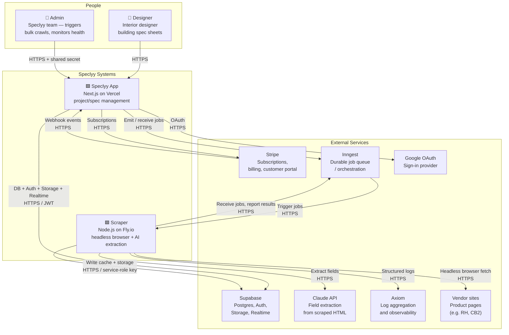
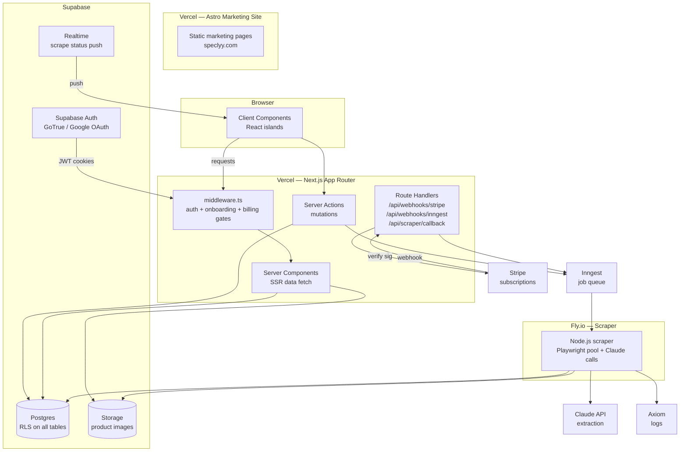

# System Overview

Top-level view of Speclyy's architecture. Start here, then follow links into component-specific docs.

---

## What Speclyy is

Speclyy is a spec-building tool for interior designers. A designer pastes a product URL, and the system scrapes the vendor page, uses Claude to extract structured specification fields (dimensions, finish, price, etc.), and pre-fills a spec sheet — saving the copy-paste work that happens dozens of times per project.

The product is a Next.js web app deployed on Vercel. The AI scraper is a separate long-running Node.js service on Fly.io, triggered asynchronously via Inngest. Supabase provides Postgres, Auth, Storage, and Realtime. Stripe handles subscriptions.

---

## System context



---

## Containers



---

## Primary user flows

### 1. Add item — cache hit (~100 ms)

```
Designer pastes URL
→ Next.js Server Action checks scrape_cache (url_hash)
→ Cache hit: return extracted_data
→ Form pre-filled instantly
```

### 2. Add item — cache miss (async, 10–60 s)

```
Designer pastes URL
→ Server Action: insert scrape_cache (status: pending), emit scrape/url.requested to Inngest
→ Item saved immediately; UI shows "Fetching..." via Supabase Realtime subscription
→ Inngest triggers scraper on Fly.io
→ Scraper: Playwright fetch → Claude extraction → image re-host to Supabase Storage
→ Scraper: update scrape_cache (status: success | failed)
→ Supabase Realtime pushes update to browser
→ UI: fields populate (or failure UX shown)
```

Full detail: [scraper/on-demand.md](scraper/on-demand.md)

### 3. Sign-in / onboarding

```
/sign-in → Google OAuth → /auth/callback → set httpOnly cookies
→ New user: /onboarding/name → /onboarding/studio → /onboarding/market → /projects
→ Returning user: /projects
```

Full detail: [auth.md](auth.md)

### 4. Subscribe / upgrade

```
/billing → Stripe Checkout session (Server Action)
→ Stripe hosted checkout
→ checkout.session.completed webhook → POST /api/webhooks/stripe
→ Drizzle (service-role) updates subscriptions table
→ Middleware subscription gate lifts on next request
```

Full detail: [billing.md](billing.md)

### 5. Admin bulk crawl

```
POST /api/admin/crawl/brand (shared-secret auth)
→ Server Action fans out URL list to Inngest
→ Inngest cron + domain throttle
→ Scraper processes each URL → populates scrape_cache
→ Cache flywheel: subsequent designer requests hit cache
```

Full detail: [scraper/bulk-crawl.md](scraper/bulk-crawl.md)

---

## Data ownership

| Data | Owner | Access pattern |
|---|---|---|
| User identity | Supabase Auth (`auth.users`) | Never modified directly; read via JWT |
| User profile | `public.profiles` | RLS: own row only |
| Subscription state | `public.subscriptions` | RLS: own row only; written by Stripe webhook via service-role |
| Projects / groups / items | `public.projects`, etc. | RLS: owner only |
| Scrape cache | `public.scrape_cache` | Written by scraper (service-role); read by all authenticated users |
| Product images | Supabase Storage (`product-images` bucket) | Written by scraper; public-read |
| Billing state | Stripe (source of truth) + `subscriptions` (mirror) | Stripe webhooks reconcile DB |

---

## Trust boundaries

```
┌─────────────────────────────────────────────┐
│  Browser (untrusted)                         │
│  - anon Supabase key only                    │
│  - httpOnly cookies; no JWT visible to JS    │
└────────────────────┬────────────────────────┘
                     │ HTTPS + cookie
┌────────────────────▼────────────────────────┐
│  Vercel / Next.js (semi-trusted)             │
│  - Verifies Supabase JWT on every request    │
│  - Service-role key only in Route Handlers   │
│  - Stripe sig verified before processing     │
└──────┬───────────────────────┬──────────────┘
       │ service-role          │ Inngest job
┌──────▼──────┐        ┌───────▼──────────────┐
│  Supabase   │        │  Fly.io Scraper       │
│  (trusted)  │        │  (trusted, internal)  │
│  RLS off    │        │  service-role key      │
│  for Drizzle│        │  no user JWT context  │
└─────────────┘        └──────────────────────┘
```

Key rules:
- `SUPABASE_SERVICE_ROLE_KEY` only in Route Handlers and the scraper — never in RSC, Server Actions, or client bundles.
- Admin APIs authenticated via shared secret; never exposed to browser.
- Stripe webhooks verified via `stripe.webhooks.constructEvent` before any DB write.

Full security detail: [security.md](security.md)

---

## Deployment topology

| Surface | Host | Deploy trigger |
|---|---|---|
| Next.js app | Vercel | Push to `main` |
| Astro marketing | Vercel (separate project) | Push to `main` |
| Scraper | Fly.io | Manual `fly deploy` (or CI) |
| Postgres + Auth + Storage + Realtime | Supabase | Migrations via `supabase db push` |
| Job queue | Inngest cloud | Serverless; no deploy needed |
| Log aggregation | Axiom cloud | Serverless; no deploy needed |

Full detail: [deployments.md](deployments.md)

---

## Cross-references

| Doc | Covers |
|---|---|
| [application.md](application.md) | Route groups, RSC vs Client, Server Actions, data fetching, env vars |
| [marketing.md](marketing.md) | Astro site, Islands, Vercel monorepo setup |
| [auth.md](auth.md) | Sign-in flow, session lifecycle, middleware gates, RLS |
| [database.md](database.md) | Full schema, dual-client pattern, migrations, RLS policies |
| [storage.md](storage.md) | Buckets, upload flows, image transforms, signed URLs |
| [scraper/README.md](scraper/README.md) | Scraper overview and sub-doc index |
| [billing.md](billing.md) | Stripe checkout, webhooks, trial/lapse, failure handling |
| [security.md](security.md) | Threat model, secrets, trust boundaries, data retention |
| [operations.md](operations.md) | Observability, SLOs, alerting, runbooks |
| [deployments.md](deployments.md) | Environments, CI/CD, migration promotion, rollout/rollback |
| [estimated-infra-costs.md](estimated-infra-costs.md) | Per-component cost at 500 designers |
